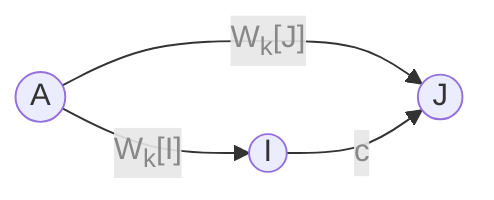
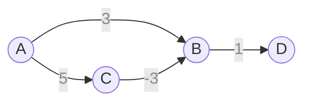
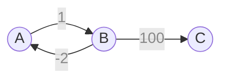

## 소개

벨만-포드 알고리즘은 그래프상의 한 정점에서 출발점으로 하여 다른 모든 정점에 대해서 최단 경로를 찾는 알고리즘이다. 최단 경로를 찾는 또 다른 알고리즘인 다익스트라와 달리 벨만-포드 알고리즘은 음수 간선을 지닌 그래프에서도 동작한다. 벨만-포드 알고리즘은 그래프의 정점이 $N$개이면 출발점에서 다른 정점들로 가는 모든 단순 경로(한 번 방문한 정점을 다시 방문하지 않는 경로) 중 어느 것도 $N-1$개보다 더 많은 간선을 거칠 수 없음을 이용한다.

## 원리

정점의 개수가 $N$인 그래프에서 시작점 $\text A$에 대하여 최단 거리표 $W_{k}$을 다음과 같이 정의하자.

> $W_{k}[n] \overset{\underset{\mathrm{def}}{}}{=}$ 시작점에서 출발해 간선을 $k$개 이하로 거쳐 정점 $n$로 가는 최소 경로의 길이

만약 그러한 경로가 없을 경우에는 무한대로 간주한다. $W_{0}$은 $W_{0}[A]$만 0으로 초기화하고 나머지 셀은 전부 무한으로 초기화한다. $W_{k}$를 안다고 가정하자. 이를 바탕으로 $W_{k+1}$를 구할 수 있을까? $W_{k+1}$는 $W_{k}$의 경로에서 간선을 한 번 더 지날 수 있게 된 것으로 해석할 수 있다.



만약 정점 $\text I$에서 정점 $\text J$로 가는 간선의 가중치가 $c$이고 $W_{k}[\text I] + c < W_{k}[\text J]$라면 (즉 $W_{k}[\text I]$가 함유하는 방법으로 정점 $\text I$로 간 뒤 가중치가 $c$인 간선을 통해 정점 $\text J$로 가는 방법이 기존의 $W_{k}[\text J]$의 방법보다 거리가 짧다면) $W_{k+1}[\text J]$를 $W_{k}[\text I] + c$로 결정할 수 있을 것이다. 이러한 방식으로 $W_{0}$으로부터 $W_{1}$을 구하고, $W_{1}$로부터 $W_{2}$을 구하며, 재귀적으로 $W_{N-1}$을 구할 수 있다. $W_{N-1}$은 $N-1$개 이하의 간선을 거쳐 갈 때의 최단 거리이므로 우리가 구하고자 하는 궁극적인 최단 거리표가 될 것이다.

예시로 이해해보자. 다음과 같은 그래프에 시작점 정점 $\text A$가 있다고 가정하자.



|         |  $\text A$  |  $\text B$  |  $\text C$  |  $\text D$  |
| ---     | ---         | ---         | ---         | ---         |
| $W_{0}$ |  0          |  ∞          |  ∞          |  ∞          |

$W_{0}$을 바탕으로 $W_{1}$을 구해보자. 정점 $\text A$에서부터 간선을 딱 한 개 거쳐 이동할 수 있는 정점는 $\text B$와 $\text C$가 있으므로 이를 갱신해 줄 수 있다.

|         |  $\text A$  |  $\text B$  |  $\text C$  |  $\text D$  |
| ---     | ---         | ---         | ---         | ---         |
| $W_{1}$ |  0          |  3          |  5          |  ∞          |

$W_{1}$을 바탕으로 $W_{2}$을 구해보자. $W_{1}$의 방법으로 정점 $\text B$로 간 뒤 간선을 하나 더 거치면 정점 $\text D$로 갈 수 있으므로 이를 갱신해준다. $W_{1}$의 방법으로 정점 $\text C$로 간 뒤 간선을 하나 더 거쳐 정점 $\text B$로 가는 방법은 $W_{1}$의 방법으로 정점 $\text B$로 가는 방법보다 짧다. 따라서 $W_{2}[B] = W_{1}[C] + (-3) = 2$이다.

|         |  $\text A$  |  $\text B$  |  $\text C$  |  $\text D$  |
| ---     | ---         | ---         | ---         | ---         |
| $W_{2}$ |  0          |  2          |  5          |  4          |

$W_{2}$을 바탕으로 $W_{3}$을 구해보자. 앞서 계산한 $W_{2}[D]$보다 $W_{2}[B] + 1$이 더 짧으므로 $W_{3}[D] = W_{2}[B] + 1 = 3$이다.

|         |  $\text A$  |  $\text B$  |  $\text C$  |  $\text D$  |
| ---     | ---         | ---         | ---         | ---         |
| $W_{3}$ |  0          |  2          |  5          |  3          |

이렇게 해서 완성한 $W_{3}$은 이 그래프의 궁극적인 최단 거리표이다.

### 음수 사이클

음수 가중치 그래프에서 최단 경로를 계산할 때의 주의할 점은 해당 그래프가 음수 사이클을 가지고 있을 수 있다는 것이다. 음수 사이클이란 어떠한 한 정점에서 다른 정점을 거쳐 다시 돌아왔을 때 비용이 더 적어지는 경로를 말한다. 다음은 음수 사이클의 한 예이다.



정점 $\text A$에서 $\text B$를 거친 후 다시 $\text A$로 오면 총 비용이 1만큼 줄어있다. 이 행위를 무한히 반복하면 총 비용을 음의 무한대로 발산시킬 수 있다. 이 상황에서 정점 $\text A$에서 $\text C$로 가는 최단 경로를 계산해 볼 수 있는가? 결국 이 그래프에서 최단 거리를 재는 것은 무의미하다. 우리가 벨만-포드 알고리즘을 사용하여 계산한 최단 거리도 음수 사이클을 감지하지 못하면 사실은 유효하지 않을 수 있다. (위 그래프를 상대로 벨만-포드 알고리즘을 수행해보라. 적어도 음의 무한대를 표현해 주지는 못한다.) 그러므로 벨만-포드를 사용할 때는 음수 사이클을 감지해 주는 과정이 필수이다.

음수 사이클의 감지는 의외로 간단하다. $W_{N}$을 구한 뒤 $W_{N-1}$과 비교해 갱신이 일어났는지를 검사하면 된다. 만약 그래프가 음수 사이클을 가지고 있지 않다면 $W_{N-1}$은 최단 거리 문제에 대한 이 그래프에서의 최적해이므로 최단 거리를 아무리 갱신해도 변화가 일어나지 않을 것이다. 그래프가 음수 사이클을 가지고 있다면 $W_{N-1}$은 이 그래프에서의 최적해가 아니며 최단 거리가 무한히 갱신될 것이다.

## 구현

벨만-포드 알고리즘을 위해서는 그래프를 인접 리스트로 표현하는 것이 좋다. 왜냐하면 그래프의 간선을 기준으로 반복문을 설계할 것이기 때문이다. 먼저 $W_{0}$를 만들고, $W_{N-1}$을 만들기까지의 $N-1$번의 단계와 음수 사이클을 판정하기 위한 1번의 단계를 합하여 총 $N$번의 단계동안 모든 간선을 검사해 최단 거리표를 갱신해주면 된다.

```python
INF = 1_000_000_000


# edge는 인접 리스트이다.
# edge[n]은 정점 n에서 뻗어나온 모든 간선의 정보를 담은 리스트이다.
# 각 간선은 (다음 정점 번호, 간선의 가중치)의 형태로 표현한다.
def bellman_ford(edge: list[list[tuple[int, int]]], start_node: int) -> list[int]:
    result = [INF] * len(edge)
    result[start_node] = 0
    for step in range(len(edge)):
        for node in range(len(edge)):
            for next_node, cost in edge[node]:
                if result[next_node] > result[node] + cost:
                    result[next_node] = result[node] + cost
                    # 음수 사이클 판정
                    if step == len(edge) - 1:
                        raise Exception("음수 사이클 감지됨")
    return result
```

정점이 $V$개라고 하면 $V$번의 단계마다 $E$개의 모든 간선을 확인하므로 총 시간복잡도는 $O(VE)$이다.