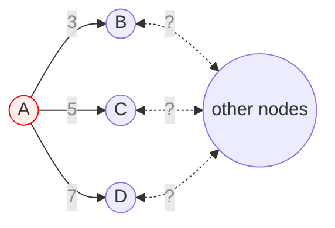
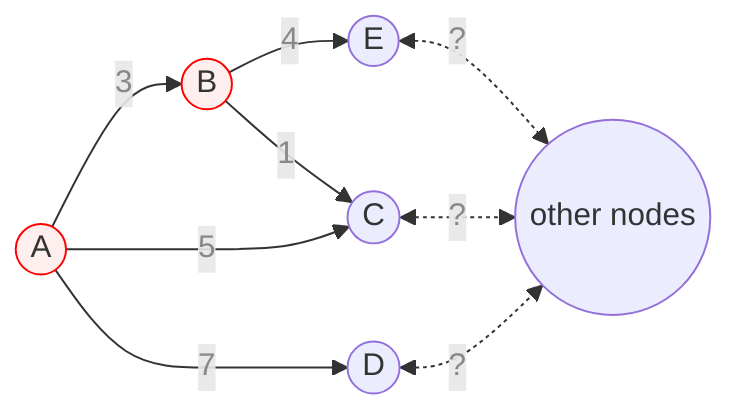

## 소개

다익스트라 알고리즘은 그래프상의 한 정점에서 출발점으로 하여 다른 모든 정점에 대해서 최단 경로를 찾는 알고리즘이다. 양방향 그래프와 방향 그래프 모두 적용할 수 있지만 간선들은 반드시 양수 가중치를 지녀야 한다. 다익스트라의 원리는 단계마다 최단 거리를 확정할 정점을 하나씩 선택해 나가는 것이다. 

## 원리

모든 간선의 가중치가 양수인 그래프에 시작점으로 선택한 정점 $\text A$가 그래프에 다음과 같은 모습으로 있다고 하자. $\text A$와 연결된 부분은 제외하고 그래프의 나머지 부분의 생김새는 생략한다.



|                         |  $\text B$  |  $\text C$  |  $\text D$  |
| ---                     | ---         | ---         | ---         |
| 현재까지 계산된 최단 거리 |  3          |  5          |  7          |

정점 $\text B$로 3보다 더 적은 비용으로 도달할 수 있는 방법이 있는가? $\text A$에서 어떠한 다른 경로를 거치더라도 $\text B$에 도달하는 데 드는 비용은 3보다 작을 수 없다는 것을 직관적으로 알 수 있다. 왜냐하면 $\text A$에 연결된 다른 간선들은 모두 해당 간선보다 가중치가 큰 것과 더불어 이 그래프의 간선의 가중치가 전부 양수이므로 다른 간선을 지나왔을 때 총 비용이 줄어드는 일이 없기 때문이다. 이는 다익스트라를 양수 가중치의 그래프에만 적용할 수 있는 이유이기도 하다. 우리는 이 단계에서 정점 $\text B$까지의 최단 거리가 3이라고 확정할 수 있다. 이제 다음을 보자.



|                         |  $\text B$  |  $\text C$  |  $\text D$  |  $\text E$  |
| ---                     | ---         | ---         | ---         | ---         |
| 현재까지 계산된 최단 거리 |  3          |  4          |  7          |  7          |

정점 $\text B$에 닿았으니 이제 정점 $\text B$에서 도달할 수 있는 정점들을 조사해 지도를 확장했다. 정점 $\text C$는 출발점에서 바로 가는 방법보다 정점 $\text B$를 거쳐서 가는 것이 비용이 더 적게 드므로 해당 값을 갱신해 줄 수 있다. 이 단계에서도 우리는 최단 거리를 확정할 정점 하나를 또 선정해야 한다. 어떤 정점이 좋을까? 최단 거리가 확정된 $\text B$를 제외하고 가장 거리가 짧은 정점 $\text C$는 이전 단계의 논리를 그대로 적용하여 현재 계산된 거리가 최단 거리임을 확정 지을 수 있다. 따라서 이 단계에서는 정점 $\text C$까지의 최단 거리를 4로 확정짓는다. 다익스트라는 이러한 방식으로 모든 정점에 대해서 최단 거리를 계산한다.

## 구현

### 기본 구현법

다익스트라 알고리즘을 구현해보자. 매 단계마다 하는 연산은 다음과 같다.

1. 가장 최근에 최단 거리를 확정 지은 정점에 연결된 다른 정점을 조사해 최단 거리 표를 갱신해준다.
2. 최단 거리가 확정되지 않은 정점들 중 현재까지 계산된 최단 거리가 가장 짧은 정점의 최단 거리를 확정해준다.

가장 처음 단계에서는 시작점의 최단 거리를 0으로 확정지었다고 가정하고 알고리즘을 구성하면 된다.

```python
INF = 1_000_000_000

# weight는 간선의 가중치를 나타내는 2차원 배열이다. 즉, 인접행렬이다.
# weight[a][b]는 정점 a에서 b로 가는 간선의 가중치이다.
# 정점 a에서 b로 가는 간선이 없다면 weight[a][b]는 INF이다.
# a == b라면 weight[a][b]는 0이다.
def dijkstra(weight: list[list[int]], start_node: int) -> list[int]:
    result = [INF] * len(weight)  # 최단 거리 표
    confirmed = [False] * len(weight)
    # 초기화
    result[start_node] = 0
    confirmed[start_node] = True
    confirmed_node = start_node
    # 단계 진입
    for _ in range(len(weight) - 1):
        next_node_dist = INF
        next_node: int
        for i in range(len(weight)):
            # 최단 거리 표 갱신
            result[i] = min(result[i], result[confirmed_node] + weight[confirmed_node][i])
            if not confirmed[i] and result[i] < next_node_dist:
                next_node_dist = result[i]
                next_node = i
        # 최단 거리 확정
        confirmed[next_node] = True
        confirmed_node = next_node
    return result
```

위 다익스트라 함수의 시간복잡도는 매 단계마다 $O(N)$의 시간이 걸리므로 $O(N^2)$이다.

### 우선순위 큐

각 단계에서 최단 거리를 확정지을 정점을 정할 때 최단 거리 표를 검사하는 과정을 거쳤었다. 이를 모두 훓지 않고 우선순위 큐를 통해 구하면 각 단계의 시간복잡도를 $O(\log N)$으로 줄일 수 있으므로 총 시간복잡도를 $O(N\log N)$으로 최적화할 수 있다. 우선 그래프를 표현하는 방법을 인접 행렬에서 인접 리스트로 교체한 후 우선순위 큐를 만들고 우선순위 큐에서 나온 순서대로 정점들의 최단 거리를 확정한 뒤 해당 정점에 연결된 정점을 조사해 다시 우선순위 큐에 넣는 단계를 반복해 나간다.

```python
import heapq

INF = 1_000_000_000

# edge는 인접 리스트이다.
# edge[n]은 정점 n에서 뻗어나온 모든 간선의 정보를 담은 리스트이다.
# 각 간선은 (다음 정점 번호, 간선의 가중치)의 형태로 표현한다.
def dijkstra(edge: list[list[tuple[int, int]]], start_node: int) -> list[int]:
    result = [INF] * len(edge)  # 최단 거리 표
    pq = []  # 우선순위 큐
    confirmed = [False] * len(edge)
    # 초기화
    result[start_node] = 0
    heapq.heappush(pq, (0, start_node))
    # 단계 진입
    while pq:
        _, now = heapq.heappop(pq)
        if confirmed[now]:
            continue
        confirnmed[now] = True
        for node, cost in edge[now]:
            if result[node] > result[now] + cost:
                result[node] = result[now] + cost
                heapq.heappush(pq, (result[node], node))
    return result
```