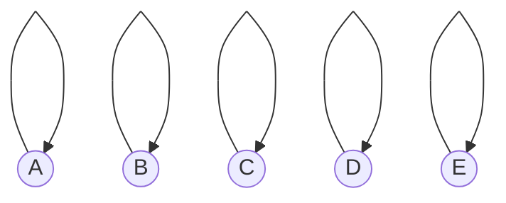
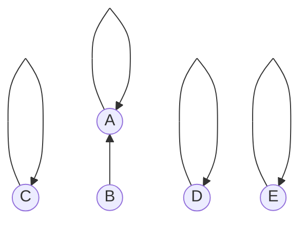
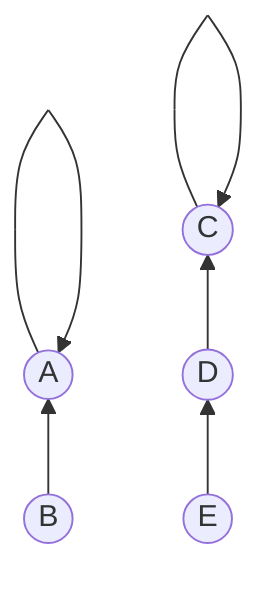
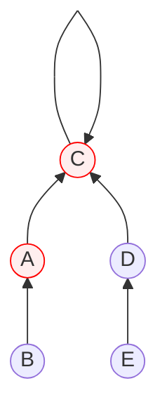
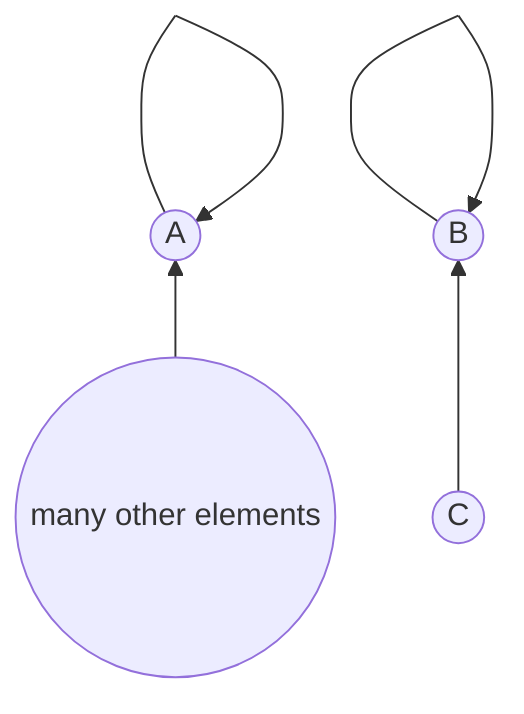
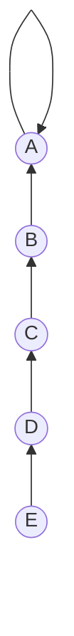
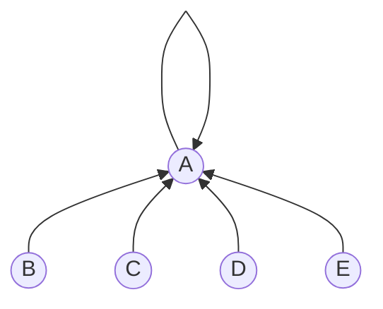

## 소개

분리 집합이란 두 원소를 피연산자로 하는 다음 연산을 지원하는 자료구조이다.

1. 원소가 속한 두 집합을 합치는 연산(Union 연산)
2. 같은 집합에 속해있는지를 판별하는 연산(Find 연산)

분리 집합은 위 둘을 구현하기 위해 트리를 사용한다.

## 원리

기본적인 원리는 같은 집합에 있는 원소들을 트리로 엮어 같은 루트를 가지게 하는 것이다. 처음에는 모든 원소가 각각 다른 집합에 있다고 가정한다. 원소들은 자신의 부모를 가리키는 화살표를 하나씩 가지고 있다고 생각하면 된다. 따라서 원소들의 초기 모습은 다음과 같이 자기 자신을 부모로 지정하고 있다. 이들 각각의 루트는 자기 자신이 된다.



먼저 집합을 합치는 연산을 어떻게 구현할지 생각해보자. 어떠한 두 원소가 같은 집합에 속하게 만드는 것은 두 원소의 루트를 같게 만들어 주는 것이다. 만약 원소 $\text A$와 $\text B$를 같은 집합으로 합친다고 한다면 $\text A$나 $\text B$중 하나의 화살표가 다른 원소를 향하도록 바꾸면 된다. 아래 예시에서는 원소 $\text B$가 원소 $\text A$를 가리키도록 하였다.



이로서 원소 $\text A$와 $\text B$의 루트가 $\text A$로 같아졌다. 위와 같은 방법으로 다른 원소들도 합쳐서 다음과 같이 $\lbrace \text{A, B} \rbrace$, $\lbrace \text{C, D, E} \rbrace$와 같은 상태가 되었다고 가정하자.



위 상황에서 집합을 합치는 연산의 피연산자로 $\text B$와 $\text E$가 들어왔다고 해보자. 원소 $\text B$와 $\text E$가 속한 두 집합을 합칠 땐 원소 $\text B$와 $\text E$ 둘만을 고려하는 것이 아니라 두 원소가 속한 집합에 있는 모든 원소가 같은 집합이 되도록 만들어주어야 한다. 이를 위해서는 화살표를 바꾸는 대상이 원소 $\text B$와 $\text E$ 각각의 루트가 되어야 한다. 따라서 다음과 같이 바꿔주어야 한다.



## 구현

분리 집합을 구현할 때는 원소의 루트를 찾는 `find` 함수와 원소의 집합을 합치는 `union` 함수로 분할해 구현하는 유니온-파인드(Union-Find) 구현법이 정석이며 구현이 아주 쉽다. 먼저 다음과 같이 원소의 개수를 길이로 갖는 배열을 초기화한다. 이 배열 각각의 인덱스에는 해당 원소의 화살표의 방향, 즉 부모의 인덱스를 담고 있다.

```python
root = list(range(count))
```

### Union

집합을 합치는 연산은 아래에서 구현할 `find` 함수를 사용해 피연산자로 들어온 두 원소의 루트를 찾고, 그 둘 중 하나의 화살표를 다른 하나를 향하도록 바꿔주면 된다.

```python
def union(a: int, b: int):
    root[find(a)] = find(b)
```

#### 큰 집합으로 합치기

아래와 같이 엄청나게 많은 원소가 루트로 $\text A$를 취하고 있고, 단 한개의 원소 $\text C$만이 원소 $\text B$를 루트로 취하는 상황이 있을 수 있다.



이 상황에서 두 집합을 합친다고 하면 화살표의 방향을 어떻게 하면 좋을까? 나중을 생각한다면 루트를 찾는 연산의 시간을 최적화하도록 $\text B$에서 $\text A$를 향하도록 바꾸는 것이 나을 것이다. 이를 구현하려면 집합의 크기를 저장하는 변수를 만들어주고 집합을 합칠때마다 이를 갱신해주면 된다.

```python
size = [1] * count

def union(a: int, b: int):
    small, big = sorted([find(a), find(b)], key=lambda x: size[x])
    if small != big:
        size[big] += size[small]
        root[small] = big
```

위 코드에서 `size` 배열의 각 인덱스에는 해당 원소가 루트일 때의 집합의 크기를 나타낸다. 주의할 점은 해당 원소가 루트일때만 그 값이 유효하다는 것이다.

### Find

원소의 루트를 찾는 `find` 함수는 다음과 같다. 루트 원소는 화살표가 자기 자신을 향한다는 점을 이용하여 반복문 탈출 조건을 설정하면 된다.

```python
def find(n: int) -> int:
    while root[n] != n:
        n = root[n]
    return n
```

#### 경로 단축

집합을 합치다보니 다음과 같은 상황이 벌어졌다고 가정하자.



`find` 함수의 인자로 $\text E$가 계속해서 주어지는 상황이 있을 수 있다. 위 구현의 경우 매 호출시마다 $\text E$에서 부터 $\text A$까지의 원소를 전부 훓어야 한다. 이러한 반복적인 작업을 없애 `find` 함수를 최적화할 수 있다. 방법은 해당 원소의 루트를 구할 때마다 다음 그림과 같이 화살표 방향이 바로 루트로 향하도록 갱신해주는 것이다.



이를 구현하기 위해서 재귀 방식을 사용한다. `find` 함수의 호출시마다 매번 화살표 방향의 갱신을 시도함을 볼 수 있다.

```python
def find(n: int) -> int:
    if root[n] != n:
        root[n] = find(root[n])
    return root[n]
```

### 전체 구현

위 최적화된 구현을 토대로 한 전체적인 구현은 다음과 같다. 외부 클래스로 한 번 더 감싸고 같은 집합인지를 판별하는 연산을 추가했다.

```python
class DisjointSet:
    def __init__(self, count: int):
        self.root = list(range(count))
        self.size = [1] * count

    def find(self, n: int) -> int:
        if self.root[n] != n:
            self.root[n] = self.find(self.root[n])
        return self.root[n]

    def union(self, a: int, b: int):
        small, big = sorted([self.find(a), self.find(b)], key=lambda x: self.size[x])
        if small != big:
            self.size[big] += self.size[small]
            self.root[small] = big
    
    # 같은 집합인지 판별
    def same_set(self, a: int, b: int) -> bool:
        return self.find(a) == self.find(b)
```

`union` 함수의 시간복잡도는 사실상 `find` 함수의 시간복잡도와 같으며, `find` 함수의 연산은 최악의 경우의 여러 호출 중 단 한 번 $O(N)$에 그칠 뿐이고 나머지 호출에서는 전부 $O(1)$이다. 따라서 분리 집합을 이용하면 집합 연산을 아주 빠르게 수행할 수 있다.