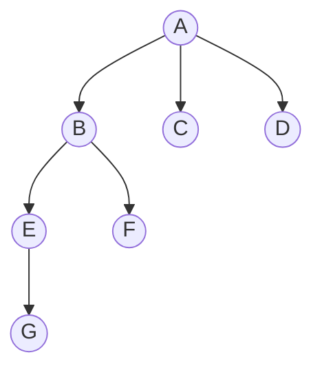
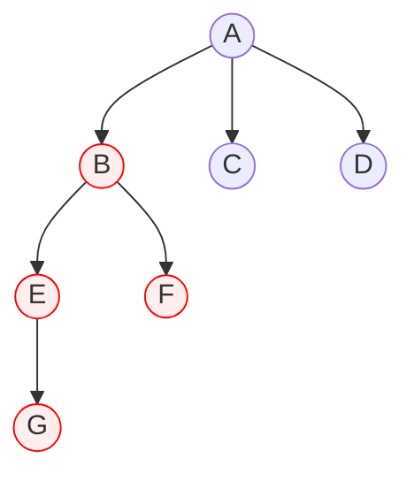
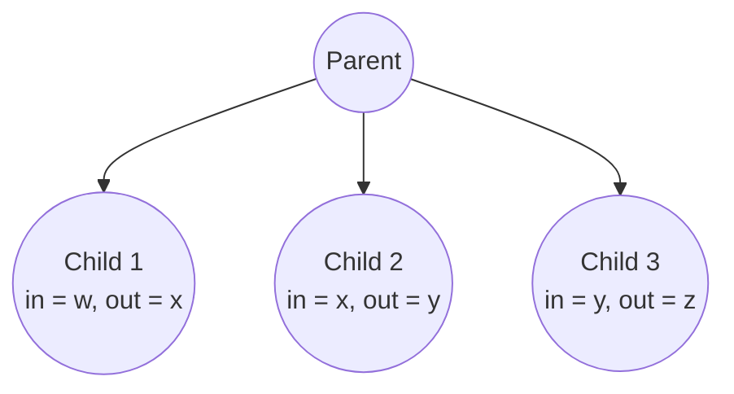
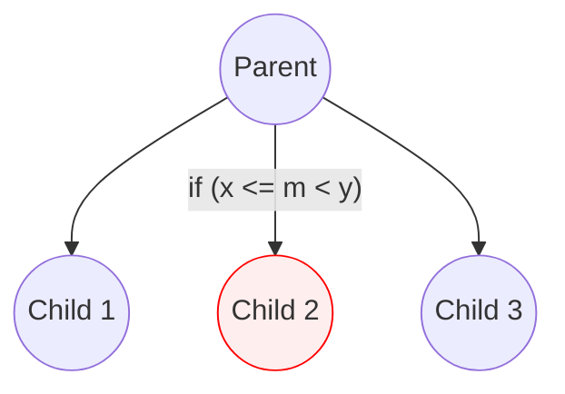

## 소개

트리는 비선형 자료구조다. 비선형이라고 함은 적어도 2차원 상에서 생각해야 한다는 것이다. 오일러 경로 테크닉은 비선형 자료구조인 트리를 다루기 쉬운 선형 자료구조로 환원하는 방법을 제시한다. 오일러 경로 테크닉이라고 해서 오일러 경로에 대한 정의나 오일러 경로를 구하는 알고리즘을 알 필요는 없다.

## 원리

오일러 경로 테크닉은 쉽게 말해서 DFS로 정점에 순서를 부여하고 그 순서대로 나열하는 것이다. 아래 트리를 오일러 경로 테크닉을 통해 정점에 순서를 부여해보자.




위 트리를 옆의 그림과 같이 DFS 방식으로 순회하면서 각 정점에 총 두 개의 번호 $\text{in}$, $\text{out}$을 부여한다. $\text{in}$은 DFS를 하면서 정점에 방문한 순서이고, $\text{out}$은 해당 정점을 탈출하는 시점에서 다음으로 방문할 정점에 부여할 $\text{in}$ 번호이다. 번호를 전부 매기면 다음과 같이 될 것이다.

|              | $\text A$ | $\text B$ | $\text C$ | $\text D$ | $\text E$ | $\text F$ | $\text G$ |
| ---          | ---       | ---       | ---       | ---       | ---       | ---       | ---       |
| $\text{in}$  | 0         | 1         | 5         | 6         | 2         | 4         | 3         |
| $\text{out}$ | 7         | 5         | 6         | 7         | 4         | 5         | 4         |

정점들을 $\text{in}$ 번호 순서대로 나열하고 배열을 만들어보자. 각 정점의 $\text{in}$ 번호가 이 배열에서의 인덱스와 일치한다.

$$
\left[\text{A, B, E ,G, F, C, D}\right]
$$

$\text{in}$ 번호와 $\text{out}$ 번호는 무엇을 의미할까? 신기하게도 어떠한 정점 $\text X$를 루트로 하는 서브 트리의 모든 정점는 $\text X$의 $\text{in}$ 번호와 $\text{out}$ 번호의 사이에 있다. 즉 $\text{in}$ 번호와 $\text{out}$ 번호는 서브 트리의 구간을 나타낸다. 예시로 정점 $\text B$를 보자. 정점 $\text B$의 $\text{in}$ 번호와 $\text{out}$ 번호가 각각 1과 5이므로, $\text B$를 루트로 하는 서브 트리의 모든 정점들은 배열에서 1 이상 5 미만의 인덱스 구간에 있다. 이상($\le$)과 미만($<$)에 유의해야 한다.

$$
\text{A, [B, E ,G, F], C, D}
$$



오일러 경로 테크닉은 다시 해석하면 서브 트리들의 모든 정점들을 배열의 인접한 구간에 위치하도록 하는 것이다. 이렇게 만들면 서브 트리 및 조상 정점와 후손 정점 사이에 대한 쿼리를 세그먼트 트리 등을 적용해 쉽게 풀 수 있다.

## 응용

### 후손까지 경로 찾기

트리의 어떤 정점에서부터 임의의 후손 정점까지의 경로를 찾아야 한다고 해보자. 후손 정점까지 가려면 수많은 자식 정점을 선택하면서 전진해야 할 것이다.



전진할 자식 정점을 선택하려면 자식 정점들의 $\text{in}$ 번호와 $\text{out}$ 번호가 나타내는 범위를 보면 된다. 탐색하는 정점의 $\text{in}$ 번호를 $m$이라고 하면 자식 정점 중 $m$을 범위에 포함하고 있는 정점로 전진한다. 왜냐하면 $\text{in} \le m < \text{out}$는 곧 그 정점을 서브 트리의 정점로 가지고 있다는 뜻이기 때문이다.



각 정점 안에서는 자식 정점들이 $\text{in}$ 번호 기준으로 정렬되어 있으므로 해당되는 자식 정점을 선택할 때 이분 탐색을 적용할 수 있다. 

### 최소 공통 조상

최소 공통 조상 문제는 트리의 어떠한 두 정점이 주어지면 해당 정점들의 가장 가까운 공통 조상을 찾는 문제이다. 이 문제는 오일러 경로 테크닉을 사용하여 $O(\log N)$ 시간만에 해결할 수 있다. 이에 대한 글은 [최소 공통 조상](/posts/lca) 포스트에 있다.

### 서브 트리에 대한 쿼리

각 정점이 가중치를 지니고 있는 트리가 있다. 이 트리에서 다음과 같은 문제를 정의할 수 있다.

> 다음 쿼리를 처리하는 프로그램을 작성하라.
> 1. `set x v`: 정점 `x`를 루트로 하는 서브 트리의 모든 정점의 가중치에 `v`를 더한다.
> 2. `print x`: 정점 `x`의 가중치를 출력한다.

1번 쿼리를 DFS로 해결하려 할 경우 매 쿼리마다 $O(N)$이므로 많은 시간이 걸릴 것이다. 이 문제는 오일러 경로 테크닉으로 만든 배열을 lazy propagation 기법을 적용한 세그먼트 트리로 관리하면 풀 수 있다. 임의의 정점의 서브 트리의 모든 정점들은 배열에서 해당 정점의 $\text{in}$ 번호와 $\text{out}$ 번호 사이에 있으므로 이를 배열에서의 구간 쿼리로 해석해 $O(\log N)$만에 쿼리를 수행할 수 있다.

$$
\text{A, [B, E ,G, F], C, D}
$$


## 구현

오일러 경로 테크닉은 결국 단순 DFS의 결과이므로 구현이 어렵지 않다. 아래 코드는 정점 객체에 오일러 경로 테크닉 함수를 구현한 것이다.

```python
class Node:
    def __init__(self):
        self.edge: list['Node'] = []  # 간선으로 연결된 다른 정점들
        self.in_num = 0
        self.out_num = 0

    # 오일러 경로 테크닉으로 생성되는 리스트 반환
    def euler_tour(self, array: list['Node'] = [], parent: 'Node' or None = None, num: int = 0) -> list['Node']:
        self.in_num = num
        self.out_num = num + 1
        array.append(self)
        for node in self.edge:
            if node is not parent:
                node.euler_tour(array, self, self.out_num)  # 재귀
                self.out_num = node.out_num
        return array


# 두 정점의 연결
def connect(a: Node, b: Node):
    a.edge.append(b)
    b.edge.append(a)
```

루트 정점의 `euler_tour` 함수를 호출하면 트리의 모든 정점의 `in_num`과 `out_num`이 계산되며 그로 인해 만들어지는 배열이 반환된다. 이 배열을 이용해 최소 공통 조상을 구하거나 서브 트리에 대한 쿼리를 처리하는 알고리즘을 구현하는 것은 독자의 몫이다.