## 소개

유량 그래프란 간선에 유량이라는 속성이 있는 그래프이다. 유량은 우리가 생각하는 수도관 파이프로 비유해 이해하면 쉽다. 다음과 같은 그래프에서 모든 간선을 물이 흐르는 파이프이며 모든 정점은 단지 여러 파이프의 연결부라고 생각하자. 간선에 쓰여있는 수들은 해당 간선에 시간당 한 번에 흐를 수 있는 물의 최대 용량(Capacity)이다. 유량 그래프에서 간선에는 방향이 있을 수도 있고 없을 수도 있다.

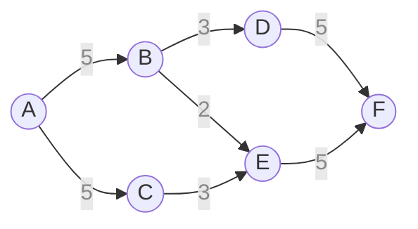

정점 $\text A$가 이 그래프에 물을 공급하는 소스(Source)라고 한다면 정점 $\text F$는 최종적으로 물이 모이는 싱크(Sink)가 된다. 유량 그래프에서 흐르는 물을 흔히 유량(Flow)이라고 표현한다. 이 글에서도 그래프에 흐르는 물을 유량이라고 표현하겠다. 이 유량은 각 라우터 간의 트래픽 볼륨으로도 비유할 수 있다. 그래서 유량 그래프는 네트워크 분야에서 흔히 사용된다.

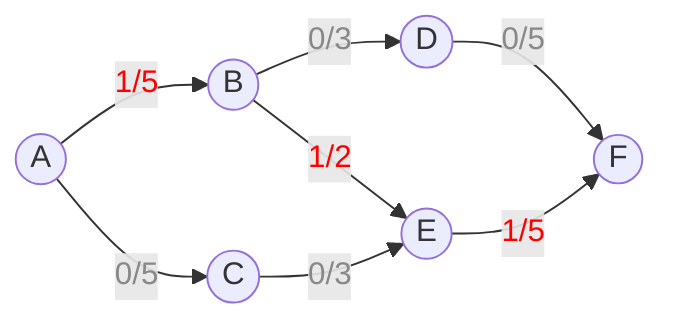

만약 정점 $\text A$에 시간당 1 만큼의 유량이 나온다면 정점 $\text F$에는 시간당 얼마만큼의 유량이 쏟아질까? 간선의 용량들이 여유로우므로 당연히 1 만큼의 유량이 모두 정점 $\text F$에 도달한다. 위의 그림은 정점 $\text A$에서 $\text F$로 1의 유량이 흐르는 한 예시이다. 꼭 현실 세계처럼 모든 파이프에 잔잔하게 유량이 흐르지 않아도 되며 유량이 다음 속성을 지키기만 한다면 어떠한 경로든 유량을 흘려도 괜찮다.

1. 유한성: 간선의 유량은 반드시 간선의 용량보다 작거나 같다. 즉 간선의 용량에서 간선의 유량을 뺀 값은 항상 0보다 크거나 같다.
2. 대칭성: $u$에서 $v$로 유량 $f$이 흐르는 것은 $v$에서 $u$로 유량 $-f$이 흐르는 것과 같다.
3. 보존성: 소스와 싱크를 제외한 모든 정점에서 들어온 유량의 합과 나가는 유량의 합이 같다.

특히 대칭성은 나중에 설명할 최대 유량 문제를 푸는 데 유용하게 쓰이는 성질이다.

### 구현

유량 그래프를 구현해보자. 각 간선과 정점을 객체로 만들고 외부 클래스로 감쌌다. 아래 구현은 객체지향적 구현으로 성능을 중시하는 구현과는 거리가 멀다는 것을 참고하기 바란다.

```python
class Graph:
    # 간선
    class Edge:
        def __init__(self, s: 'Graph.Node', e: 'Graph.Node', capacity: int):
            self.node = (s, e)
            self.capacity = capacity
            self.flow = 0

        # 간선에 연결된 노드를 반환
        def get_node(self, node: 'Graph.Node') -> 'Graph.Node':
            i = self.node.index(node)
            return self.node[i ^ 1]
        
        # 간선의 잔여 용량을 반환
        def get_remain(self, node: 'Graph.Node') -> int:
            i = self.node.index(node)
            return (1 - i) * self.capacity + (-1 + 2 * i) * self.flow
        
        # 간선에 유량을 흘림
        def give_flow(self, node: 'Graph.Node', flow: int):
            i = self.node.index(node)
            self.flow += (1 - 2 * i) * flow
    
    # 정점
    class Node:
        def __init__(self):
            self.edge: list[Graph.Edge] = []

    # 생성자, 그래프의 크기와 소스 및 싱크를 입력받음
    def __init__(self, size: int, source: int, sink: int):
        self.node = [Graph.Node() for _ in range(size)]
        self.source, self.sink = self.node[source], self.node[sink]

    # 두 정점을 간선으로 이음
    def connect(self, a: int, b: int, capacity: int):
        new_edge = Graph.Edge(self.node[a], self.node[b], capacity)
        self.node[a].edge.append(new_edge)
        self.node[b].edge.append(new_edge)
```

여기서 간선의 구현에 주목하자. 간선의 각 함수들인 `get_node`, `get_remain`, `give_flow`는 호출 시 인자로 받은 정점에 따라 해당 간선의 정보를 다르게 계산하고 있다. 왜냐하면 유량의 대칭성에 의해 간선의 시작점 방향에서 바라봤을 때와 간선의 도착점 방향에서 바라봤을 때의 간선의 잔여 용량이 다르기 때문이다. 이는 최대 유량 문제의 해결에서 더 자세히 다룬다.

## 최대 유량 문제

여기서 다음과 같은 문제를 생각해 볼 수 있다. 만약 정점 $\text A$에 시간당 무한대의 유량이 나온다면 정점 $\text F$에는 시간당 얼만큼의 유량이 도달하게 될까? 간선이 허용하는 용량 선에서 정점 $\text F$에 유량이 도달할 것은 분명하다. 직접 그림을 그려 계산해보면 다음과 같이 정점 $\text F$에는 최대 8의 유량이 닿는다는 것을 볼 수 있다.

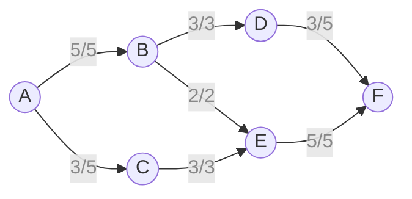

이처럼 유량 그래프의 소스에서 무한대의 유량이 나온다고 가정했을 때 싱크에 도달할 수 있는 최대 유량을 구하는 문제를 최대 유량 문제라고 한다. 어떠한 유량 그래프가 주어졌을 때 싱크로 흐르는 최대 유량을 구할 때 고려해야 할 사항이 엄청 많아 보인다. 임의의 유량 그래프에서 최대 유량 문제를 어떻게 해결할 수 있을까?

### 포드-풀커슨

해결법은 그래프에 유량이 더 이상 흐를 수 없을때까지 유량을 소량씩 흘려보내는 것을 반복하는 것이다. 즉, 다음과 같은 절차를 반복한다.

1. 용량이 남아있는 간선을 따라 소스부터 싱크까지 가는 증가 경로(augmenting path)를 찾는다. 찾지 못할 경우 종료한다.
2. 찾은 경로를 따라 흘릴 수 있는 최대의 유량을 흘린다.

아래 예시를 통해 이해해보자. 다음과 같이 정점 $\text A$가 소스, 정점 $\text D$가 싱크인 유량 그래프가 있다. 우리는 눈으로 간단히 이 그래프의 최대 유량이 10임을 알 수 있다. 과연 그 해답이 위 절차를 반복함으로서 도출되는 지 알아보자.

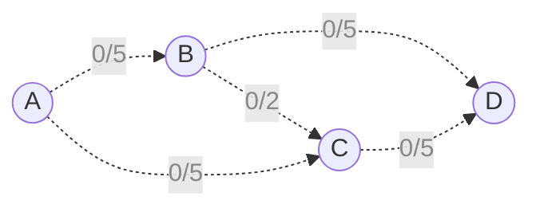

위 유량 그래프에서 증가 경로를 다음과 같이 찾을 수 있다.

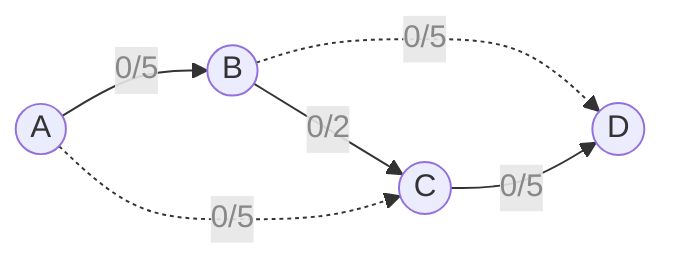

찾은 경로에 유량을 흘린다. 위 경로를 통해 최대로 흘릴 수 있는 유량이 2이므로 2의 유량을 흘려준다.

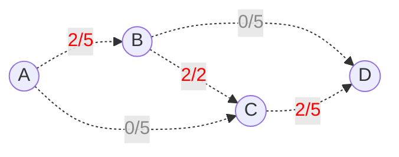

이제 다시 증가 경로를 찾는 단계로 되돌아간다. 이러한 단계를 더 이상 증가 경로가 보이지 않을때까지 반복한다.

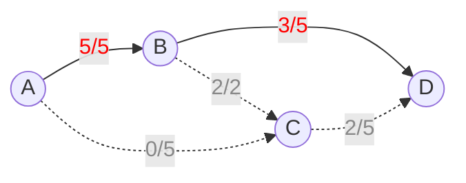
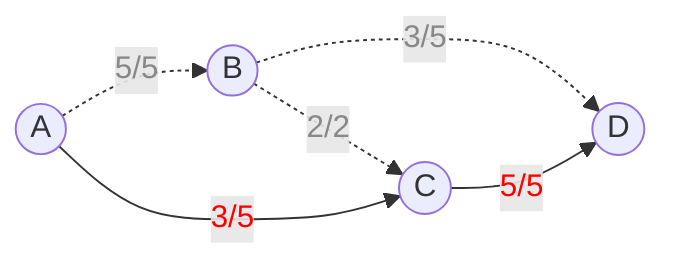

이제 위 그래프에서 증가 경로를 찾을 수 있는가? 우리 눈에는 증가 경로를 찾을 수 없지만 분명 이 그래프의 최대 유량이 8이 아닌 10이라는 것은 알고 있다. 그렇다면 숨겨진 증가 경로가 있는 것일까? 그렇다. 이는 유량의 대칭성을 이용하면 된다. 우선 각 간선들의 반대 방향으로 용량이 0인 간선을 추가로 그어준다. 이와 같은 간선이 유량 그래프의 최대 유량에 영향을 미치지 않음은 직관적으로 알 수 있다. 이제 유량의 대칭성에 의해 유량을 흘려준 간선의 반대 방향으로 같은 양의 음의 유량을 흘려 주었다고 생각하고 다시 그래프를 그려보자.

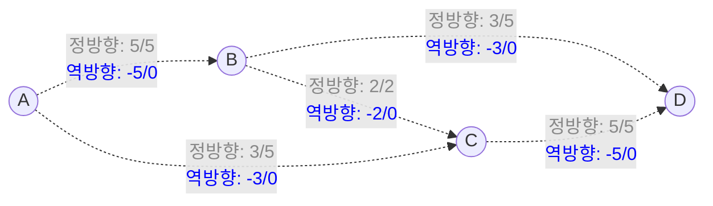

이제 증가 경로가 보일 것이다. 다음과 같은 경로는 간선의 잔여 용량, 즉 간선의 총 용량에서 현재 흐르고 있는 유량을 뺀 값이 양수인 간선만을 이용해 소스에서 싱크로 가고 있으므로 증가 경로라고 할 수 있다.

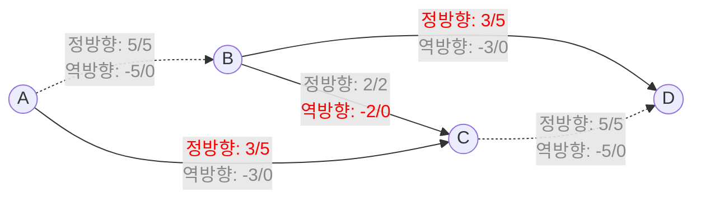

이제 유량을 흘려준다.

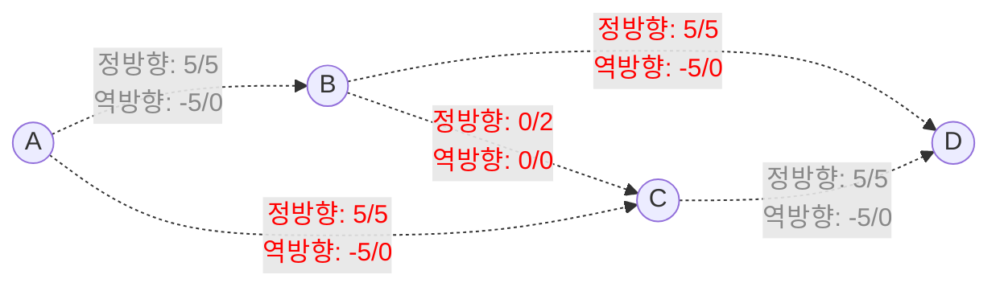

이제 더 이상 증가 경로를 찾을 수 없으므로 종료가 된다. 종료가 되고 나면 이 그래프의 최대 유량이 10이라는 것을 알 수 있다. 이렇듯 유량의 대칭성을 이용해 숨겨진 증가 경로까지 전부 찾아내어 더 이상 유량이 흐를 수 없을때까지 그래프를 포화시켰을 때의 유량이 해당 그래프의 최대 유량이다. 이러한 방법을 포드-풀커슨 방법이라고 한다.

#### 구현

```python
from itertools import count

INF = 1_000_000_000


class Graph:
    visit_id = count(1)

    class Edge:
        def __init__(self, s: 'Graph.Node', e: 'Graph.Node', capacity: int):
            self.node = (s, e)
            self.capacity = capacity
            self.flow = 0

        def get_node(self, node: 'Graph.Node') -> 'Graph.Node':
            i = self.node.index(node)
            return self.node[i ^ 1]

        def get_residual(self, node: 'Graph.Node') -> int:
            i = self.node.index(node)
            return (1 - i) * self.capacity + (-1 + 2 * i) * self.flow

        def give_flow(self, node: 'Graph.Node', flow: int):
            i = self.node.index(node)
            self.flow += (1 - 2 * i) * flow

    class Node:
        def __init__(self):
            self.edge: list[Graph.Edge] = []
            self.visit_id = 0

        def dfs(self, sink: 'Graph.Node', min_residual: int) -> int:
            if self is sink:
                return min_residual
            for edge in self.edge:
                node = edge.get_node(self)
                residual = edge.get_residual(self)
                if node.visit_id != self.visit_id and residual > 0:
                    node.visit_id = self.visit_id
                    flow = node.dfs(sink, min(residual, min_residual))
                    if flow > 0:
                        edge.give_flow(self, flow)
                        return flow
            return 0

    def __init__(self, size: int):
        self.node = [Graph.Node() for _ in range(size)]

    def connect(self, a: int, b: int, capacity: int):
        new_edge = Graph.Edge(self.node[a], self.node[b], capacity)
        self.node[a].edge.append(new_edge)
        self.node[b].edge.append(new_edge)

    def ford_fulkerson(self, source: int, sink: int) -> int:
        result = 0
        flow = 1
        while flow:
            self.node[source].visit_id = next(Graph.visit_id)
            flow = self.node[source].dfs(self.node[sink], INF)
            result += flow
        return result
```

포드-풀커슨 방법의 시간복잡도는 간선이 가질 수 있는 용량의 범위에 비례해 영향을 받는다. 왜냐하면 매번 흘리는 유량의 값이 최소 1이므로 최대 $F$번의 DFS 탐색이 필요하기 때문이다. 따라서 그래프의 정점의 개수를 $V$, 간선의 개수를 $E$, 간선 용량의 최댓값 $F$라 하면 포드-풀커슨 방법의 시간복잡도는 $O((V + E)F)$이다.

#### 에드몬드-카프

에드몬드-카프 알고리즘은 포드-풀커슨 방법의 일종이며 기존 포드-풀커슨 방법과 다른 점은 DFS 대신 BFS를 사용하여 간선이 적은 그래프에서 빠르게 작동한다는 것이다.

```python
from itertools import count
from collections import deque

INF = 1_000_000_000


class Graph:
    visit_id = count(1)

    class Edge:
        def __init__(self, s: 'Graph.Node', e: 'Graph.Node', capacity: int):
            self.node = (s, e)
            self.capacity = capacity
            self.flow = 0

        def get_node(self, node: 'Graph.Node') -> 'Graph.Node':
            i = self.node.index(node)
            return self.node[i ^ 1]

        def get_residual(self, node: 'Graph.Node') -> int:
            i = self.node.index(node)
            return (1 - i) * self.capacity + (-1 + 2 * i) * self.flow

        def give_flow(self, node: 'Graph.Node', flow: int):
            i = self.node.index(node)
            self.flow += (1 - 2 * i) * flow

    class Node:
        def __init__(self):
            self.edge: list[Graph.Edge] = []
            self.visit_id = 0
            self.visited_by: Graph.Edge or None = None
            self.min_residual = INF

    def __init__(self, size: int):
        self.node = [Graph.Node() for _ in range(size)]

    def connect(self, a: int, b: int, capacity: int):
        new_edge = Graph.Edge(self.node[a], self.node[b], capacity)
        self.node[a].edge.append(new_edge)
        self.node[b].edge.append(new_edge)

    def edmonds_karp(self, source: int, sink: int) -> int:
        result = 0
        while True:
            queue = deque([self.node[source]])
            visit_id = next(Graph.visit_id)
            self.node[source].visit_id = visit_id
            while queue:
                now = queue.popleft()
                for edge in now.edge:
                    node = edge.get_node(now)
                    residual = edge.get_residual(now)
                    if node.visit_id != visit_id and residual > 0:
                        node.visit_id = visit_id
                        node.visited_by = edge
                        node.min_residual = min(residual, now.min_residual)
                        queue.append(node)
            if self.node[sink].visit_id != visit_id:
                break
            result += self.node[sink].min_residual
            now = self.node[sink]
            while now is not self.node[source]:
                pre = now.visited_by.get_node(now)
                now.visited_by.give_flow(pre, self.node[sink].min_residual)
                now = pre
        return result
```

에드몬드-카프 알고리즘은 정점의 개수가 $V$, 간선의 개수가 $E$인 그래프에서 BFS의 횟수가 많아야 $VE$번이라는 것이 증명되어 있다. 따라서 에드몬드-카프 알고리즘의 시간복잡도는 $O(VE^2)$이다.

### 디닉

디닉 알고리즘은 최대 유량을 레벨 그래프(Level Graph)의 개념을 적용하여 빠르게 구하는 알고리즘이다. 레벨 그래프란 각 정점에 잔여 용량이 있는 간선만을 이용해 BFS를 수행할 때 방문 깊이를 구하고, 잔여 용량이 남아있으면서 깊이가 1만큼 차이나는 정점을 잇는 간선만을 남겨놓은 그래프이다. 다음 예제로 디닉 알고리즘의 작동 절차를 설명하겠다. 이 예시는 [영문 위키피디아](https://en.wikipedia.org/wiki/Dinic%27s_algorithm) 자료를 그대로 가져온 것이며 디닉 알고리즘을 설명할 때 아주 많이 쓰인다.


우선 레벨 그래프를 구축한다. 즉, 잔여 용량이 남은 간선을 이용해 BFS를 수행하면서 정점마다 방문 깊이를 저장하고 깊이가 1만큼 차이나는 정점을 잇는 간선만을 남겨둔다. 그 후 이 그래프를 특화된 DFS를 이용해 소스부터 싱크까지의 경로를 찾고 유량을 흘려준다. 이 떄 흘려준 유량을 차단 유량(Blocking Flow)이라고 한다.


이것이 디닉 알고리즘의 한 단계이다. 한 단계를 끝마친 후 그래프의 모습은 아래와 같다.


한 단계를 더 수행해본다. 즉, 다시 레벨 그래프를 구축하고 차단 유량을 흘린다. 아래 레벨 그래프 그림은 잔여 용량을 간선의 원래 용량처럼 보고 레벨 그래프를 그린 것이다.


한 단계를 더 반복해 레벨 그래프를 구축하면 다음과 같이 더 이상 싱크까지 레벨 그래프를 구축할 수 없다. 이렇게 되면 디닉 알고리즘은 끝이 난다.


디닉 알고리즘은 정점의 개수가 $V$, 간선의 개수가 $E$인 그래프에서 최대 $O(V)$번의 단계가 시행될 수 있으며, 각 단계에서 차단 유량을 찾는 데 걸리는 시간복잡도가 $O(VE)$임이 알려져 있다. 따라서 디닉 알고리즘의 시간복잡도는 $O(V^2E)$이다.

#### 구현

```python
from itertools import count
from collections import deque

INF = 1_000_000_000


class Graph:
    visit_id = count(1)

    class Edge:
        def __init__(self, s: 'Graph.Node', e: 'Graph.Node', capacity: int):
            self.node = (s, e)
            self.capacity = capacity
            self.flow = 0

        def get_node(self, node: 'Graph.Node') -> 'Graph.Node':
            i = self.node.index(node)
            return self.node[i ^ 1]

        def get_remain(self, node: 'Graph.Node') -> int:
            i = self.node.index(node)
            return (1 - i) * self.capacity + (-1 + 2 * i) * self.flow

        def give_flow(self, node: 'Graph.Node', flow: int):
            i = self.node.index(node)
            self.flow += (1 - 2 * i) * flow

    class Node:
        def __init__(self):
            self.edge: list[Graph.Edge] = []
            self.visit_id = 0
            self.level = 0
            self.pivot = 0

        def dfs(self, sink: 'Graph.Node', min_residual: int) -> int:
            if self is sink:
                return min_residual
            for edge in self.edge[self.pivot:]:
                node = edge.get_node(self)
                remain = edge.get_remain(self)
                if node.level == self.level + 1 and remain > 0:
                    flow = node.dfs(sink, min(remain, min_residual))
                    if flow > 0:
                        edge.give_flow(self, flow)
                        return flow
                self.pivot += 1
            return 0

    def __init__(self, size: int):
        self.node = [Graph.Node(i) for i in range(size)]

    def connect(self, a: int, b: int, capacity: int):
        new_edge = Graph.Edge(self.node[a], self.node[b], capacity)
        self.node[a].edge.append(new_edge)
        self.node[b].edge.append(new_edge)

    def dinic(self, source: int, sink: int) -> int:
        result = 0
        while True:
            visit_id = next(Graph.visit_id)
            self.node[source].visit_id = visit_id
            self.node[source].pivot = 0
            queue = deque([self.node[source]])
            while queue:
                now = queue.popleft()
                for edge in now.edge:
                    node = edge.get_node(now)
                    remain = edge.get_remain(now)
                    if node.visit_id != visit_id and remain > 0:
                        node.visit_id = visit_id
                        node.level = now.level + 1
                        node.pivot = 0
                        queue.append(node)
            if self.node[sink].visit_id != visit_id:
                break
            flow = 1
            while flow:
                flow = self.node[source].dfs(self.node[sink], INF)
                result += flow
        return result
```