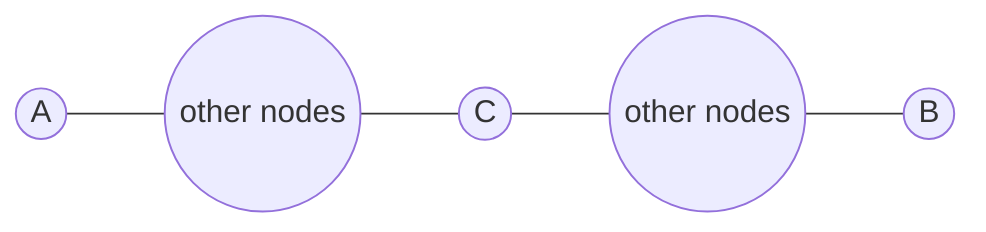
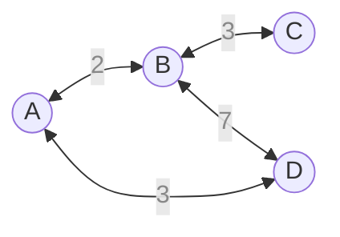

## 소개

플로이드-워셜 알고리즘은 그래프의 모든 정점 간의 최단 거리를 찾는 알고리즘이다. 주로 그래프를 인접행렬로 표현한 상태에서 많이 쓰이는 방법이다. 양방향 그래프와 방향 그래프 모두 적용할 수 있으며 음수 가중치를 허용한다. 플로이드-워셜 알고리즘은 어떠한 두 정점 간의 최단 경로를 그 경로의 속한 두 최단 경로의 합으로 생각하는 데서 출발한다.

## 원리
어떠한 두 정점 $\text A$와 $\text B$ 사이의 최단 경로가 다음과 같이 정점 $\text C$를 경유한다고 가정하자.



위 그림에서 정점 $\text A$와 $\text B$ 사이의 최단 경로는 정점 $\text A$와 $\text C$, 정점 $\text C$와 $\text B$의 최단 경로의 합이라고 생각할 수 있다. 또한 정점 $\text A$와 $\text C$ 사이의 최단 경로는 방금처럼 그사이의 어떤 정점에 접하는 두 최단 경로의 합으로 생각할 수 있고, 이러한 재귀적인 생각은 두 정점 사이의 경로에 경유하는 정점이 없어질 때까지(즉 두 정점이 직접 연결될 때까지) 반복할 수 있을 것이다. 이를 반대로 생각하면 모든 정점의 직접 연결 정보, 즉 인접행렬을 가지고 모든 정점 사이의 최단 경로를 구하는 알고리즘을 생각해 볼 수 있다. 먼저 다음과 같은 그래프가 있고 이를 인접행렬 $W_{\varnothing}$로 표현했다고 가정하자.



| $W_{\varnothing}$ |  $\text A$  |  $\text B$  |  $\text C$  |  $\text D$  |
| ---               | ---         | ---         | ---         | ---         |
|  $\text A$        |  0          |  2          |  ∞          |  3          |
|  $\text B$        |  2          |  0          |  3          |  7          |
|  $\text C$        |  ∞          |  3          |  0          |  ∞          |
|  $\text D$        |  3          |  7          |  ∞          |  0          |

연결되어 있지 않은 정점들 간의 거리는 무한으로 초기화한다. 우선 정점 $\text A$를 중간 정점로서 경유하는 것부터 생각해보자. 정점 $\text B$와 $\text D$는 직접 가는 것보다 정점 $\text A$를 경유하는 것이 더 거리가 짧다. 즉, 다음을 만족한다.

$$
\displaylines{W_{\varnothing}[\text B][\text D] > W_{\varnothing}[\text B][\text A] + W_{\varnothing}[\text A][\text D] \\ W_{\varnothing}[\text D][\text B] > W_{\varnothing}[\text D][\text A] + W_{\varnothing}[\text A][\text B]}
$$

따라서 $W_{\varnothing}[\text B][\text D]$와 $W_{\varnothing}[\text D][\text B]$을 수정해 다음과 같이 $\text A$를 중간 정점로 사용했을 때의 최단 거리 표인 $W_{\lbrace \text A \rbrace}$을 얻는다.

| $W_{\lbrace \text A \rbrace}$ |  $\text A$  |  $\text B$  |  $\text C$  |  $\text D$  |
| ---                     | ---         | ---         | ---         | ---         |
|  $\text A$              |  0          |  2          |  ∞          |  3          |
|  $\text B$              |  2          |  0          |  3          |  5          |
|  $\text C$              |  ∞          |  3          |  0          |  ∞          |
|  $\text D$              |  3          |  5          |  ∞          |  0          |

$W_{\lbrace \text A \rbrace}$는 다른 말로 하면 이 그래프 상에서 $\text A$를 중간 정점로 사용할 수 있을 때의 최단 거리표이다. 여기서 추가로 정점 $\text B$를 중간 정점로 사용하겠다고 선언하자. 우리의 목표는 $\text A$와 $\text B$를 중간 정점로 사용할 수 있을 때의 최단 거리표 $W_{\lbrace \text A, \text B \rbrace}$를 구하는 것이다. 정점 $\text C$는 정점 $\text B$를 통해서 $\text A$와 $\text D$에 닿을 수 있다. 우리는 앞서 $W_{\lbrace \text A \rbrace}$를 구해놓았으며 $W_{\lbrace \text A \rbrace}$는 $\text B$와 $\text D$의 경로가 $\text A$를 경유하면 더 빨라진다는 사실을 담고 있다. 따라서 정점 $\text C$에서 $\text D$를 갈 때 $W_{\lbrace \text A \rbrace}$를 참고하여 $\text{C - B - D}$ 경로 대신 $\text A$를 거쳐 가는 더 빠른 경로를 얻을 수 있다. 즉, $W_{\lbrace \text A, \text B \rbrace}$를 구할 때는 이전에 구해놓았던 $W_{\lbrace \text A \rbrace}$을 사용하면 된다는 것을 직관적으로 알 수 있다.

$$
\displaylines{W_{\lbrace \text A \rbrace}[\text C][\text A] > W_{\lbrace \text A \rbrace}[\text C][\text B] + W_{\lbrace \text A \rbrace}[\text B][\text A] \\ W_{\lbrace \text A \rbrace}[\text A][\text C] > W_{\lbrace \text A \rbrace}[\text A][\text B] + W_{\lbrace \text A \rbrace}[\text B][\text C] \\ W_{\lbrace \text A \rbrace}[\text C][\text D] > W_{\lbrace \text A \rbrace}[\text C][\text B] + W_{\lbrace \text A \rbrace}[\text B][\text D] \\ W_{\lbrace \text A \rbrace}[\text D][\text C] > W_{\lbrace \text A \rbrace}[\text D][\text B] + W_{\lbrace \text A \rbrace}[\text B][\text C]}
$$

| $W_{\lbrace \text A, \text B \rbrace}$ |  $\text A$  |  $\text B$  |  $\text C$  |  $\text D$  |
| ---                        | ---         | ---         | ---         | ---         |
|  $\text A$                 |  0          |  2          |  5          |  3          |
|  $\text B$                 |  2          |  0          |  3          |  5          |
|  $\text C$                 |  5          |  3          |  0          |  8          |
|  $\text D$                 |  3          |  5          |  8          |  0          |

위의 논리를 계속해서 반복해 $W_{\lbrace \text A, \text B \rbrace}$로부터 $W_{\lbrace \text A, \text B, \text C \rbrace}$를 얻을 수 있고, $W_{\lbrace \text A, \text B, \text C \rbrace}$로부터 $W_{\lbrace \text A, \text B, \text C, \text D \rbrace}$를 얻을 수 있다. (실제로 구해보면 갱신될 것이 없으므로 위의 표와 동일하게 나올 것이다.) $W_{\lbrace \text A, \text B, \text C, \text D \rbrace}$는 그래프 상의 모든 정점을 중간 정점로 사용할 수 있다는 뜻이므로 결국 이 그래프 상의 궁극적인 최단 거리표가 될 것이다.

## 구현

플로이드-워셜의 구현은 굉장히 아름답다. 단순한 3중 반복문이면 되기 때문이다. $W$에서 시작해 중간 정점 $m$을 하나씩 추가하면서 모든 시작점과 종점 쌍 $(s, e)$에 대해서 $m$을 거쳐가는 경로($W[s][m] + W[m][e]$)와 기존 경로($W[s][e]$) 중 어떤 것이 짧은지를 검사해 갱신해주면 된다. 다음은 그것을 간단히 수식으로 나타낸 것이다.

$$
W[s][e] := \min{(W[s][e], W[s][m] + W[m][e])}
$$


```python
from copy import deepcopy


# weight는 간선의 가중치를 나타내는 2차원 배열이다. 즉, 인접행렬이다.
# weight[A][B]는 정점 a에서 b로 가는 간선의 가중치이다.
# 정점 a에서 b로 가는 간선이 없다면 weight[A][B]는 INF이다.
# a == b라면 weight[A][B]는 0이다.
def floyd_warshall(weight: list[list[int]]) -> list[list[int]]:
    result = deepcopy(weight)
    for m in range(len(weight)):
        for s in range(len(weight)):
            for e in range(len(weight)):
                result[s][e] = min(result[s][e], result[s][m] + result[m][e])
    return result

```

플로이드-워셜 알고리즘은 단순 3중 반복문이므로 시간복잡도는 $O(N^3)$이다.
