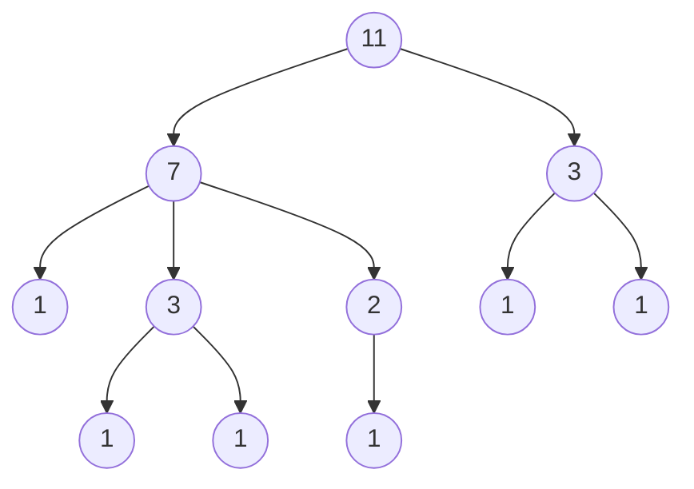
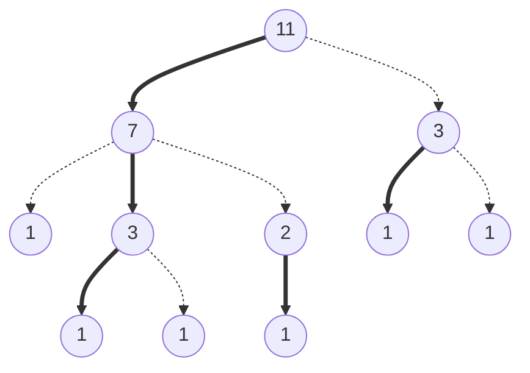
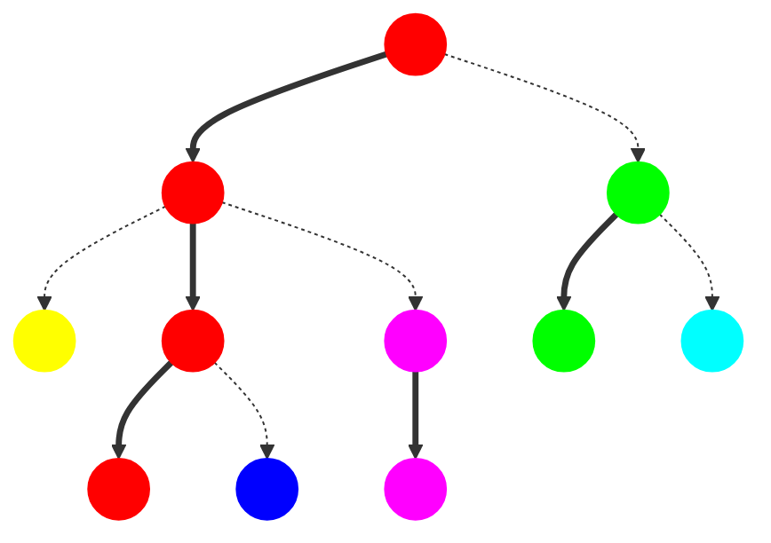
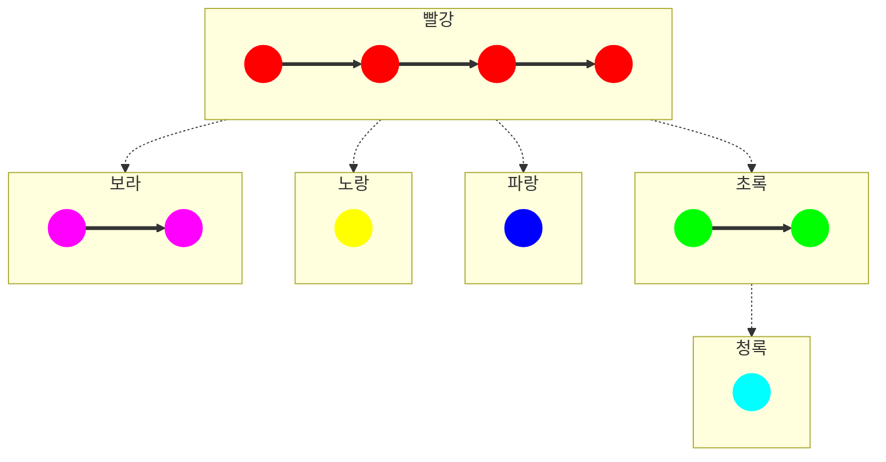
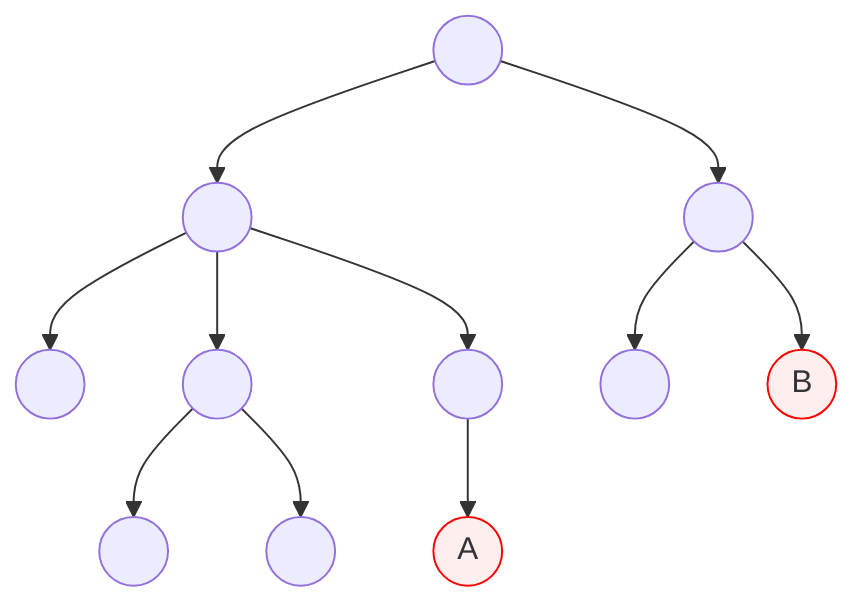

## 소개

### 문제 제시

모든 정점에 각각의 가중치가 있고 이 가중치가 수시로 바뀌는 트리가 있다. 이 트리의 임의의 두 정점 사이의 단순 경로에 있는 모든 정점의 가중치의 합을 구하는 프로그램을 만들고 싶다. 두 정점 간의 모든 정점을 DFS로 탐색하면서 더하면 $O(N)$의 시간이 걸릴 것이다. 이를 더욱 빠르게 수행하도록 만들 수 있겠는가?

### 트리 분할

이를 빠르게 해결하는 방법 중 하나는 사전에 트리의 구역을 잘게 분할해 놓는 것이다. 그 중 Heavy-Light 분할은 간선들을 "무거운 간선"과 "가벼운 간선"으로 나누어 놓고 무거운 간선들로 연결된 정점들끼리 하나의 구역으로 묶어 관리하는 기법이다. 무거운 간선들끼리 묶어 관리할 경우 트리의 임의의 두 정점 간의 단순 경로에 걸쳐있는 모든 구역의 개수가 $O(\log N)$에 비례하게 되어 더욱 빠른 쿼리 처리가 가능해진다.

## 원리

무거운 간선은 다음 관계가 성립하는 정점 $u$와 $v$를 잇는 간선으로 정의하며, 가벼운 간선은 무거운 간선이 아닌 간선으로 정의한다.

> $v$는 $u$의 자식들 중 서브 트리의 크기가 최댓값이면서 가장 왼쪽에 있는 정점이다.

아래 트리의 간선들 중 무거운 간선와 가벼운 간선들을 분류해보자. 분류하기 쉽도록 정점들의 서브 트리의 크기를 전부 써 놓았다.



위 트리에서 무거운 간선은 실선으로 나타내고 가벼운 간선들은 점선으로 나타내보자.



여기서 생각해 볼 것이 있다. 임의의 두 정점의 단순 경로에 포함된 가벼운 간선의 개수의 최댓값은 얼마일까? 어떤 정점에서 계속해서 가벼운 간선을 선택하면서 후손 정점로 간다고 해보자. 가벼운 간선을 선택하면서 전진할 경우 서브 트리의 크기는 절반 이하로 계속해서 줄어들게 될 것이다. 왜냐하면 연결된 자식의 서브 트리 크기가 본인의 절반을 넘어선다면 무조건 무거운 간선으로 연결될 수밖에 없기 때문이다. 따라서 어떠한 정점에서 후손 정점까지의 단순 경로에 포함된 가벼운 간선의 개수의 최댓값은 $O(\log N)$에 비례하며 임의의 두 정점의 단순 경로에 포함된 가벼운 간선의 개수의 최댓값도 $O(\log N)$에 비례한다. 이해가 끝났다면 이제 무거운 간선으로 이어진 정점들끼리 같은 색으로 표시해보자.



같은 색깔의 정점들은 같은 구역에 속하는 것으로 본다. 이제 트리를 구역별로 재배치해보자.



이렇게 하면 Heavy-Light 분할이 끝난 것이다. 이렇게 분할한 구역들은 세 가지 특징이 있다.

1. 구역들도 하나의 트리를 이룬다. 즉, 최소 공통 조상을 이용해 임의의 두 구역 간의 경로를 찾을 수 있다.
2. 각 구역들은 항상 가벼운 간선으로 이어져 있다. 즉, 임의의 두 구역의 거리가 $\log N$을 넘어서지 않는다.
3. 한 구역에는 이웃한 정점들이 일렬로 들어가 있다. 즉, 한 구역을 세그먼트 트리로 관리할 수 있다.

위 특징들로 인해 임의의 두 정점 사이의 단순 경로상의 모든 정점들에 대한 쿼리를 빠르게 처리할 수 있다. 아래 예시로 이해해보자.



위 그림에서 정점 $\text A$와 $\text B$ 사이의 단순 경로에 속한 정점들을 분할해놓은 구역에서 모두 표시해보자.


위와 같이 경로 상의 모든 정점이 구역 안에서 서로 이어져 있어 세그먼트 트리를 적용하기 쉬워진다. 경로 상의 정점이 속한 모든 구역들은 위 트리 상에서도 하나의 경로를 이루므로 두 정점이 속한 각각의 구역에서부터 최소 공통 조상까지 거슬러 올라가며 각 구간에 접근하도록 만들면 된다. 두 정점 간의 경로를 처리하기 위해 방문해야 하는 구역의 개수가 $O(\log N)$개이므로 각 구간에서의 처리 연산의 시간복잡도를 $O(T(N))$이라고 한다면 Heavy-Light 분할이 진행된 트리에서 임의의 두 정점 간의 경로 상에서의 쿼리를 $O(T(N)\log N)$의 시간만에 해결할 수 있다.

## 구현

이제 Heavy-Light 분할을 이용해 임의의 두 정점 간의 단순 경로 상의 모든 정점의 가중치의 합을 반환하는 트리를 작성해보자. 트리는 각 정점들의 가중치의 변경까지도 지원해야 한다. Heavy-Light 분할의 구현은 다양하므로 본 구현에 국한될 필요는 없다.

### 트리 분할

트리의 분할에 앞서 우선 트리의 각 정점이 가져야 할 정보들은 다음과 같다. 

```python
# 트리의 정점
class Node:
    def __init__(self, value: int):
        self.edge: list['Node'] = []  # 간선으로 연결된 정점
        self.value = value  # 정점 가중치
        # 첫 번째 DFS에서 초기화
        self.size = 1  # 서브 트리의 크기
        self.parent: 'Node' or None = None  # 정점의 부모
        # 두 번째 DFS에서 초기화
        self.hld_root = self  # 구역의 대표 정점
        self.hld_segtree: SegmentTree or None = None  # 구역을 관리하는 세그먼트 트리
        self.hld_depth = 0  # 구역의 깊이
        self.hld_index = 0  # 구역에서의 인덱스
```

`Node`의 구조는 분할의 각 구역마다 맨 앞 정점을 조장으로 두어 조장 정점에서 세그먼트 트리를 조작하고 나머지 정점들은 조장 정점을 참조하도록 의도한 것이다.

트리의 분할은 총 2번의 DFS로 이루어진다. 첫 번째 DFS에서는 각 정점의 서브 트리의 사이즈를 계산하고 무거운 간선을 색출해내는 작업을 하며 두 번째 DFS에서는 무거운 간선을 우선적으로 탐색하며 하나의 구역으로 묶어주는 작업을 한다.

```python
# class Node:
    # 첫 번째 DFS, 정점의 서브 트리의 크기 계산 및 무거운 간선을 edge의 맨 앞으로 위치
    def dfs1(self):
        for i, node in enumerate(self.edge):
            if node is not self.parent:
                node.parent = self
                node.dfs1()
                self.size += node.size
                # 서브 트리의 크기가 가장 큰 자식을 맨 앞으로 위치
                if self.edge[0] is self.parent or self.edge[0].size < self.edge[i].size:
                    self.edge[0], self.edge[i] = self.edge[i], self.edge[0]
```

첫 번째 DFS에서는 `Node`의 `size` 변수를 사용하여 정점의 서브 트리의 크기를 저장하고, 자식 정점들의 서브 트리의 크기를 조사하여 가장 큰 자식을 `edge` 배열의 맨 앞으로 위치시킨다. 이로서 `edge` 배열의 맨 앞에는 무거운 간선으로 연결된 자식 정점이 위치하게 된다.

```python
# class Node:
    # 두 번째 DFS, 구역을 분할하고 세그먼트 트리 생성
    def dfs2(self, array: list[int]):
        array.append(self.value)
        if self.edge[0] is not self.parent:
            # 정점이 속한 구역의 정보를 넘겨줌
            self.edge[0].hld_root = self
            self.edge[0].hld_depth = self.hld_depth
            self.edge[0].hld_index = self.hld_index + 1
            # 무거운 간선끼리 연결
            self.edge[0].dfs2(array)
            # 가벼운 간선으로 연결된 자식으로 재귀
            for i, node in enumerate(self.edge[1:]):
                if node is not self.parent:
                    node.hld_depth = self.hld_depth + 1
                    node.dfs2([])
        # 무거운 간선으로 연결된 배열을 바탕으로 세그먼트 트리 구성
        if self.hld_root is self:
            self.hld_segtree = SegmentTree(array)
```

두 번째 DFS에서는 `edge` 배열의 맨 앞 자식 정점을 계속 방문하면서 `array`에 연결하고 이를 바탕으로 세그먼트 트리를 구성한다. 자식들을 계속 방문하면서 해당 정점이 속한 구역의 정보들을 넣어준다. 가벼운 간선들로 연결된 자식들은 빈 `array`를 줌으로서 새로 연결하도록 하고 있다.

### 경로 쿼리

두 정점을 피연산자로 한 경로 쿼리 함수는 두 정점이 속한 구역의 최소 공통 조상까지 한 구역씩 거슬러 올라가면서 해당 구역의 세그먼트 트리에 쿼리를 호출하도록 하면 된다.

```python
# 두 정점의 단순 경로 상의 모든 정점의 가중치 합 반환
def get_sum(self, a: Node, b: Node) -> int:
    result = 0
    # 한 구역씩 거슬러 올라가며 세그먼트 트리 참조
    node = sorted([a, b], key=lambda x: x.hld_depth)
    while node[0].hld_root is not node[1].hld_root:
        for i in range(2):
            if node[i].hld_depth == node[1].hld_depth:
                result += node[i].hld_root.hld_segtree.get_sum(0, node[i].hld_index + 1)
                node[i] = node[i].hld_root.parent
    # 최소 공통 조상 구역에서의 구간 쿼리 처리
    node.sort(key=lambda x: x.hld_index)
    result += node[0].hld_root.hld_segtree.get_sum(node[0].hld_index, node[1].hld_index + 1)
    return result
```

### 전체 구현

아래는 Heavy-Light 분할의 전체 구현이다. 위에서 정의한 `Node` 클래스를 외부 클래스로 한 번 더 감싼 것이다.

```python
# Heavy-Light 분할을 위한 세그먼트 트리, 구간 합과 인덱스 갱신 지원
class SegmentTree:
    class Node:
        def __init__(self, array: list[int], l: int, r: int):
            if r - l > 1:
                m = (l + r) // 2
                self.left = SegmentTree.Node(array, l, m)
                self.right = SegmentTree.Node(array, m, r)
                self.value = self.left.value + self.right.value
            else:
                self.value = array[l]

        def get_sum(self, i: int, j: int, l: int, r: int) -> int:
            if i <= l and r <= j:
                return self.value
            elif not (r <= i or j <= l):
                m = (l + r) // 2
                return self.left.get_sum(i, j, l, m) + self.right.get_sum(i, j, m, r)
            else:
                return 0

        def modify(self, index: int, value: int, l: int, r: int):
            if r - l > 1:
                m = (l + r) // 2
                if index < m:
                    self.left.modify(index, value, l, m)
                else:
                    self.right.modify(index, value, m, r)
                self.value = self.left.value + self.right.value
            else:
                self.value = value

    def __init__(self, array: list[int]):
        self.size = len(array)
        self.root = SegmentTree.Node(array, 0, len(array))

    def get_sum(self, i: int, j: int) -> int:
        return self.root.get_sum(i, j, 0, self.size)

    def modify(self, index: int, value: int):
        self.root.modify(index, value, 0, self.size)


# Heavy-Light 분할을 지원하는 트리
class Tree:
    # 트리의 정점
    class Node:
        def __init__(self, value: int):
            self.edge: list['Tree.Node'] = []
            self.value = value
            self.size = 1
            self.parent: 'Tree.Node' or None = None
            self.hld_root = self
            self.hld_segtree: SegmentTree or None = None
            self.hld_depth = 0
            self.hld_index = 0
        
        def dfs1(self):
            for i, node in enumerate(self.edge):
                if node is not self.parent:
                    node.parent = self
                    node.dfs1()
                    self.size += node.size
                    if self.edge[0] is self.parent or self.edge[0].size < self.edge[i].size:
                        self.edge[0], self.edge[i] = self.edge[i], self.edge[0]

        def dfs2(self, array: list[int]):
            array.append(self.value)
            if self.edge[0] is not self.parent:
                self.edge[0].hld_root = self
                self.edge[0].hld_depth = self.hld_depth
                self.edge[0].hld_index = self.hld_index + 1
                self.edge[0].dfs2(array)
                for i, node in enumerate(self.edge[1:]):
                    if node is not self.parent:
                        node.hld_depth = self.hld_depth + 1
                        node.dfs2([])
            if self.hld_root is self:
                self.hld_segtree = SegmentTree(array)
    
    # 생성자
    def __init__(self, value: list[int], root: int, edge: list[tuple[int, int]]):
        self.node = [Tree.Node(v) for v in value]
        for a, b in edge:
            self.node[a].edge.append(self.node[b])
            self.node[b].edge.append(self.node[a])
        self.node[root].dfs1()
        self.node[root].dfs2([])

    # 정점 가중치 수정
    def modify(self, n: int, value: int):
        self.node[n].hld_root.hld_segtree.modify(self.node[n].hld_index, value)

    # 두 정점의 단순 경로 상의 모든 정점의 가중치 합 반환
    def get_sum(self, a: int, b: int) -> int:
        result = 0
        node = sorted([self.node[a], self.node[b]], key=lambda x: x.hld_depth)
        while node[0].hld_root is not node[1].hld_root:
            for i in range(2):
                if node[i].hld_depth == node[1].hld_depth:
                    result += node[i].hld_root.hld_segtree.get_sum(0, node[i].hld_index + 1)
                    node[i] = node[i].hld_root.parent
        node.sort(key=lambda x: x.hld_index)
        result += node[0].hld_root.hld_segtree.get_sum(node[0].hld_index, node[1].hld_index + 1)
        return result
```

P.S. 오일러 경로 테크닉을 사용하면 분할의 각 구역마다 하나의 세그먼트 트리를 두지 않고 전체 트리에 하나의 세그먼트 트리를 두어 해결할 수도 있다.