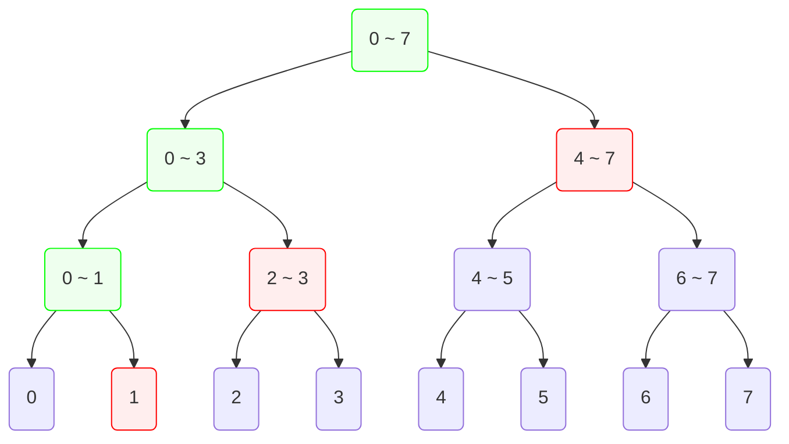
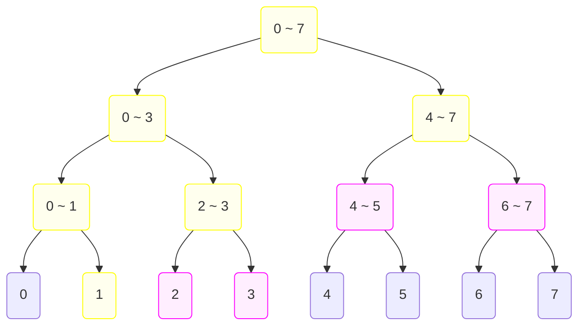
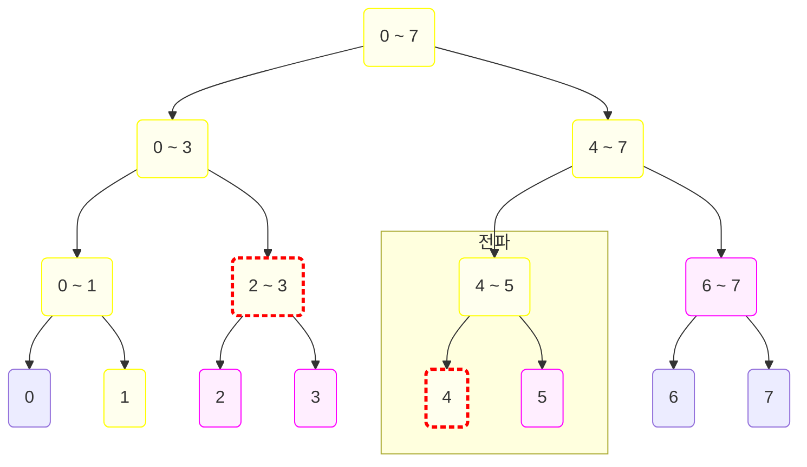

## 소개

### 문제 제시

기존의 세그먼트 트리는 한 번에 하나의 값만을 수정할 수 있었다. 하지만 어떠한 경우에는 구간 전체의 값에 수정 명령을 내리고 싶을 수도 있다. 이를테면 특정 구간에 모두 일정한 값을 더하거나 곱하도록 할 수 있다. 이를 수행하기 위해서 기존의 세그먼트 트리의 인덱스 수정 연산을 통해서 인덱스 하나하나의 값을 수정하는 방법을 취할 경우 매 구간 수정 쿼리마다 $O(N\log N)$의 시간복잡도를 가지게 되며 이는 좋은 방법이 아니다.

### 지연 갱신

이를 해결하는 한 방법으로 세그먼트 트리에 지연 갱신을 적용하는 것이다. 지연 갱신이란 갱신 명령이 들어왔을 때 실제 갱신을 실행하지 않고 명령에 대한 정보만을 저장하고 있다가 나중에 필요할 때 계산해내는 방식이다.

## 원리

우선 기존의 세그먼트 트리의 특정 한 인덱스의 값을 수정하는 연산을 떠올려보자. 특정 인덱스의 값을 수정하면 해당 인덱스를 가리키는 세그먼트 트리의 리프 정점의 모든 조상 정점을 같이 수정해주어야 했다. 지연 갱신을 적용한 세그먼트 트리 역시 주어진 구간을 나타내는 모든 정점의 조상 정점들을 같이 수정하면 과정을 거친다. 이를 구현하기 위해서 각 정점들은 자신들이 나타내는 구간의 "갱신 정보"를 저장하는 변수를 가지고 있다.

예시를 보자. 우리는 아래 세그먼트 트리로 관리하고 있는 배열에서 1 ~ 7 범위의 값에 어떠한 값 $c$를 더하려고 한다.



위 그림에서 빨간색 정점는 1 ~ 7 범위를 표현하는 정점들이다. 그리고 초록색 정점들은 루트에서부터 DFS를 통해 빨간색 정점들에 도달하기 위해서 건너왔던 정점들이며 빨간색 정점들의 모든 조상 정점이기도 하다. 우선 초록색 정점와 빨간색 정점들에 대해서는 곧바로 수정을 진행해준다. 그 후 빨간색 정점들의 자식 정점들에게는 갱신 정보인 $c$값을 저장해준다. 아래 그림에서 노란색으로 표현된 정점들은 $c$에 대한 쿼리가 적용된 정점들이고 자주색으로 표현된 정점들은 아직 값이 적용되지 않았지만 $c$에 대한 갱신 정보를 담고 있는 정점들이다.



여기까지가 구간 모든 원소에 $c$를 더하는 쿼리의 동작이다. 이 쿼리로 수정해야 하는 정점 개수의 최댓값은 $O(\log N)$ 꼴이 될 것이므로 이 쿼리의 시간복잡도 또한 $O(\log N)$이다.

여기서 구간 2 ~ 4의 합을 구한다고 해보자. 구간 합 연산 역시 기존의 세그먼트 트리처럼 DFS를 통해 연산의 대상이 되는 범위를 지닌 정점을 찾아가면 된다. 여기서 다른 점은 DFS로 지나오는 모든 정점들에 대해서 갱신 정보를 바탕으로 값을 수정해준 뒤 그 정보를 계속해서 자식 정점쪽으로 전파해주면서 진행해줘야 한다는 것이다.



위 그림에서 빨간색 테두리에 속한 정점들이 2 ~ 4의 구간을 표현하고 있는 정점이다. 빨간색 테두리로 가리키고 있는 인덱스 4의 리프 정점에 접근하는 과정에서, 4 ~ 5 구간을 가리키는 정점을 지나오면서 해당 정점이 가지고 있던 갱신 정보를 자식 정점로 전파하며 갱신을 반영한 것을 볼 수 있다. 이렇듯 모든 정점에 갱신 정보들을 누적해두고 나중에 그 값을 구할 때 누적되어있던 정보들을 적용해주면서 내려오는 것이다.

## 구현

앞서 설명한 지연 갱신 방식을 사용해 구간 합을 구하는 쿼리와 구간에 일정한 수를 더하는 쿼리를 처리하는 세그먼트 트리를 구현해 볼 것이다. 기존의 세그먼트 트리에서 달라진 구현은 각 정점들에 갱신 정보를 저장하는 변수를 새로 만든 후 구간 합을 구하는 쿼리를 처리할 때 갱신 정보를 자식 정점로 전파하는 루틴을 추가해야 한다는 것이다.

```python
class Node:
    def __init__(self, array: list[int], l: int, r: int):
        self.prop = 0  # 갱신 정보를 저장하는 변수
        if r - l > 1:
            m = (l + r) // 2
            self.left = Node(array, l, m)
            self.right = Node(array, m, r)
            self.value = self.left.value + self.right.value
        else:
            self.value = array[l]
```

### 구간 쿼리

구간 합을 구하는 연산은 기존의 세그먼트 트리와 동일하되 자식 정점로 갱신 정보를 전파하는 코드만 추가하면 된다.

```python
# class Node:
    def get_sum(self, i: int, j: int, l: int, r: int) -> int:
        # 갱신 정보의 전파
        if r - l > 1:
            self.left.prop += self.prop
            self.right.prop += self.prop
        self.value += self.prop * (r - l)
        self.prop = 0
        # 기존 세그먼트 트리의 구간 쿼리
        if i <= l and r <= j:
            return self.value
        elif not (r <= i or j <= l):
            m = (l + r) // 2
            return self.left.get_sum(i, j, l, m) + self.right.get_sum(i, j, m, r)
        else:
            return 0
```

### 구간 갱신

구간 갱신 쿼리를 처리하는 함수는 구간 합을 처리하는 함수처럼 DFS 재귀 함수로 구성하며, 각각의 정점을 방문하면서 구간 갱신 연산의 대상이 되는 구간 $\left[i, j\right)$과 현재 정점이 나타내는 구간 $\left[l, r\right)$에 대해서 다음 3가지 경우마다 처리를 달리해주면 된다.

1. $\left[l, r\right)$ 구간이 $\left[i, j\right)$ 구간 안에 포함되는 경우
2. $\left[l, r\right)$ 구간이 $\left[i, j\right)$ 구간에 포함되진 않지만 걸쳐있는 경우
3. $\left[l, r\right)$ 구간과 $\left[i, j\right)$ 구간이 겹치지 않는 경우

1의 경우 자식 정점들에 갱신 정보를 저장하고 현재 정점의 값을 갱신해주면 되며, 2의 경우는 자식 정점들로 재귀한 뒤 현재 정점의 값을 수정해주면 된다. 3의 경우에는 아무 행동도 취하지 않으면 된다.

```python
# class Node:
    def add(self, i: int, j: int, amount: int, l: int, r: int):
        if i <= l and r <= j:
            # 갱신 정보 저장
            if r - l > 1:
                self.left.prop += amount
                self.right.prop += amount
            self.value += amount * (r - l)
        elif not (r <= i or j <= l):
            m = (l + r) // 2
            self.left.add(i, j, amount, l, m)
            self.right.add(i, j, amount, m, r)
            self.value = self.left.value + self.right.value
        else:
            pass
```

### 전체 구현

아래는 전체 구현이다. 위에서 완성한 `Node` 클래스를 외부 클래스로 한 번 더 감싼 것이다.

```python
# 구간 합 구하기, 구간에 일정한 수 더하기 지원
class SegmentTree:
    class Node:
        def __init__(self, array: list[int], l: int, r: int):
            self.prop = 0
            if r - l > 1:
                m = (l + r) // 2
                self.left = SegmentTree.Node(array, l, m)
                self.right = SegmentTree.Node(array, m, r)
                self.value = self.left.value + self.right.value
            else:
                self.value = array[l]

        def get_sum(self, i: int, j: int, l: int, r: int) -> int:
            if r - l > 1:
                self.left.prop += self.prop
                self.right.prop += self.prop
            self.value += self.prop * (r - l)
            self.prop = 0
            if i <= l and r <= j:
                return self.value
            elif not (r <= i or j <= l):
                m = (l + r) // 2
                return self.left.get_sum(i, j, l, m) + self.right.get_sum(i, j, m, r)
            else:
                return 0

        def add(self, i: int, j: int, amount: int, l: int, r: int):
            if i <= l and r <= j:
                if r - l > 1:
                    self.left.prop += amount
                    self.right.prop += amount
                self.value += amount * (r - l)
            elif not (r <= i or j <= l):
                m = (l + r) // 2
                self.left.add(i, j, amount, l, m)
                self.right.add(i, j, amount, m, r)
                self.value = self.left.value + self.right.value

    # 생성자
    def __init__(self, array: list[int]):
        self.size = len(array)
        self.root = SegmentTree.Node(array, 0, len(array))

    # 구간 쿼리
    def get_sum(self, i: int, j: int) -> int:
        return self.root.get_sum(i, j, 0, self.size)

    # 구간 갱신
    def add(self, i: int, j: int, amount: int):
        self.root.add(i, j, amount, 0, self.size)
```