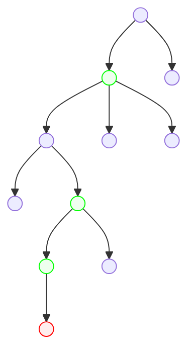
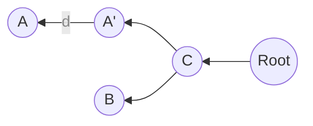
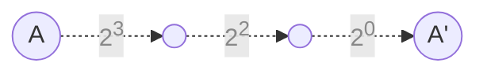
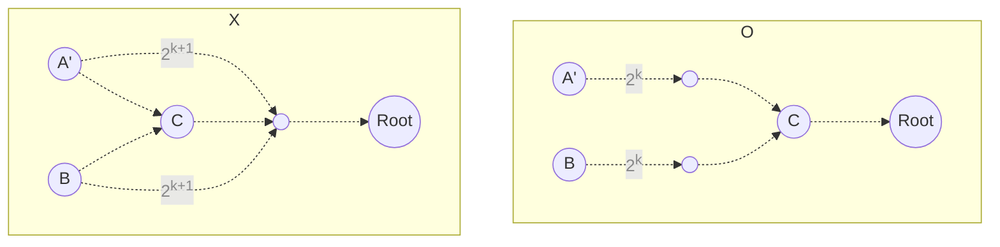
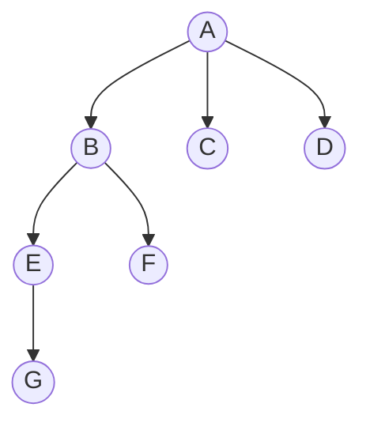
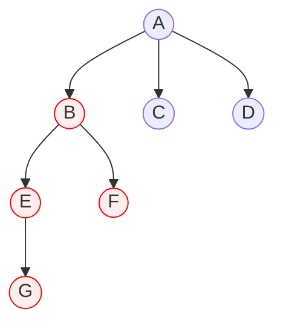

## 소개

최소 공통 조상 문제는 트리의 임의의 두 정점의 조상 정점이면서 두 정점로부터의 거리가 가장 가까운 정점을 찾는 문제이다. 최소 공통 조상 문제는 트리 상의 임의의 두 정점의 경로를 탐색하는 데에 쓰일 수 있다.

## 해결

최소 공통 조상을 찾기 위해서 우리는 단순히 두 정점에서부터 출발해 만날때까지 하나씩 올라오는 방법을 생각해 볼 수 있다. 하지만 이 방법은 크기가 $N$인 트리에서 $O(N)$의 시간복잡도를 가질 수 있어 적절하지 않다. 우리는 이 문제를 더 빠른 방법으로 해결해 볼 것이며 대표적으로 아래 두 방법이 존재한다.

### 다이나믹 프로그래밍

이 방식의 메인 아이디어는 조상 정점들을 탐색할 때 이분 탐색하듯이 거슬러 올라가도록 만드는 것이다. 우선 트리를 전처리한다. 트리 전체를 순회하면서 각 정점마다 깊이 정보와 함께 $2^n \left(n = 0, 1, 2 ...\right)$번째 조상 정점들을 저장해둘 것이다.



위 트리를 예시로 들어보자. 트리의 맨 아래 정점는 깊이가 5이고(루트의 깊이는 0이다) $2^0$, $2^1$, $2^2$번째 조상이 존재하므로 정점에 이 정보를 저장해 둔다. 모든 정점이 이러한 정보를 저장하고 있다면 최소 공통 조상 문제를 빠르게 풀 수 있다.

크기가 $N$인 트리의 임의의 정점 $\text A$와 $\text B$의 최소 공통 조상 $\text C$를 찾아가는 상황을 생각해보자. 트리는 위 예시처럼 전처리가 되어 있으며, 정점 $\text A$의 깊이가 더 크고 정점 $\text A$와 $\text C$ 경로 사이에 정점 $\text B$와 깊이가 같은 정점 $\text A'$이 있다고 하자. 도식화하면 아래 그림과 같으며 다른 정점는 생략하였다.



우선 정점 $\text A$에서부터 정점 $\text B$와 깊이가 같은 정점인 $\text A'$까지 거슬러 올라온다. 그러기 위해서 거슬러 올라가야 하는 거리인 $d$를 구한다. 이는 간단히 정점 $\text A$의 깊이에서 정점 $\text B$의 깊이를 뺀 값이다. 예시로 $d = 13$이라고 해보자. 이는 다음과 같이 표현할 수 있다.

$$
d = 13 = 1101_{2} = 2^3 + 2^2 + 2^0
$$

우리는 앞서 모든 정점의 $2^n$번째 조상 정점을 구해놓았으므로 다음과 같은 경로로 정점 $\text A$에서 정점 $\text A'$로 갈 수 있다.



즉, 정점 $\text A$에서 정점 $\text A'$로 가는 데 $O(\log N)$의 시간이 든다. 이제 정점 $\text A'$과 $\text B$에서 동시에 $\text C$를 향해 올라온다. 거슬러 올라갈 조상 정점을 선택할 떄는 $\text C$를 넘어서서 거슬러 올라가지 않으면서 가장 멀리 갈 수 있는 정점을 선택하면 된다. 이를 수학적으로 표현하면, 다음 집합의 최댓값 $m$에 대해 $2^m$번째 조상으로 계속해서 거슬러 올라가는 과정을 반복하면 된다.

> $\lbrace 0 \rbrace \cap \lbrace k | \text 2^k$번째 조상이 같지 않음$\rbrace$



위 과정을 반복하면 최소 공통 조상인 정점 $\text C$에서 만나게 될 것이다. 이 과정 역시 $O(\log N)$의 시간이 든다. 따라서 다이나믹 프로그래밍 기법을 사용한 최소 공통 조상 문제 풀이의 시간복잡도는 $O(\log N)$이다.

#### 구현

아래는 최소 공통 조상의 다이나믹 프로그래밍적 접근을 코드화한 것이다. 각 정점마다 $2^n$번째 조상을 저장하는 배열 `root`를 만들고 전처리 함수 `preprocess`를 통해 이를 채워둔다. 그리고 `lca`함수를 이용해 최소 공통 조상을 구한다.

```python
from math import log2


class Tree:
    class Node:
        def __init__(self):
            self.edge: list['Tree.Node'] = []  # 간선으로 연결된 다른 정점들
            # 2^n번째 조상을 저장하는 리스트
            # 인덱스 i는 2^i번째 조상임을 의미
            self.root: list['Tree.Node'] = []
            self.depth = 0  # 정점의 깊이

        # 전처리, 2^i번째 조상을 전부 구함
        def preprocess(self, parent: 'Tree.Node' or None = None):
            if parent is not None:
                self.depth = parent.depth + 1
                self.root.append(parent)
                now = parent
                t = 0
                while t < len(now.root):
                    now = now.root[t]
                    self.root.append(now)
                    t += 1
            for node in self.edge:
                if node is not parent:
                    node.preprocess(self)

    def __init__(self, size: int, root: int, edge: list[tuple[int, int]]):
        self.node = [Tree.Node() for _ in range(size)]
        for a, b in edge:
            a.edge.append(b)
            b.edge.append(a)
        # 전처리
        self.node[root].preprocess()

    # 최소 공통 조상 구하기
    def lca(self, a: int, b: int) -> Node:
        close, far = sorted([self.node[a], self.node[b]], key=lambda x: x.depth)
        # 더 깊이 있는 정점을 같은 깊이까지 끌어올린다
        d = far.depth - close.depth
        for i in range(int(log2(d)), -1, -1):
            if d & (1 << i):
                far = far.root[i]
        # 두 정점로부터 최소 공통 조상까지 거슬러 올라온다
        while close != far:
            t = len(far.root) - 1
            while t > 0 and far.root[t] == close.root[t]:
                t -= 1
            close, far = close.root[t], far.root[t]
        return far
```

### 오일러 경로 테크닉

[오일러 경로 테크닉]()이란 트리의 DFS 방문 순서대로 정점들을 나열하여 트리를 선형적으로 관리하는 기법이다. 오일러 경로 테크닉을 이용한 최소 공통 조상 문제의 풀이는 어떠한 정점 $\text A$와 $\text B$ 사이의 최소 공통 조상은 DFS 방문 순서상 정점 $\text A$와 $\text B$ 사이에서 반드시 재방문하게 됨을 이용한다.


최소 공통 조상 문제를 풀기 위해서는 정점에 번호를 매기는 방법을 조금 다르게 한다. 우선 빈 배열을 하나 생성한 뒤 DFS를 수행하면서 재방문을 포함해 정점에 방문할 때마다 해당 정점을 배열의 끝에 추가한다. 그리고 각 정점에는 깊이와 함께 배열에서 첫 번째와 마지막으로 등장하는 인덱스 번호를 저장한다. 아래 예시를 보자.



$$
\text{Array: }\left[\text{A,  B,  E,  G,  E,  B,  F,  B,  A,  C,  A,  D,  A}\right]
$$

|                       | $\text A$ | $\text B$ | $\text C$ | $\text D$ | $\text E$ | $\text F$ | $\text G$ |
| ---                   | ---       | ---       | ---       | ---       | ---       | ---       | ---       |
| Depth                 | 0         | 1         | 1         | 1         | 2         | 2         | 3         |
| index<sub>start</sub> | 0         | 1         | 9         | 11        | 2         | 6         | 3         |
| index<sub>end</sub>   | 12        | 7         | 9         | 11        | 4         | 6         | 3         |

이 상황에서 정점 $\text F$와 $\text G$의 최소 공통 조상을 찾아보자. 배열 상에서 정점 $\text F$나 $\text G$가 처음 등장하는 인덱스는 3, 가장 마지막으로 등장하는 인덱스는 6이다. 따라서 인덱스 3과 6 사이에 있는 정점들 중에서 깊이가 가장 작은 정점인 $\text B$가 이 두 정점의 최소 공통 조상이다.

$$
\text{A,  B,  E, }\left[\text{G,  E,  B,  F}\right]\text{,  B,  A,  C,  A,  D,  A}
$$



이는 구간 최솟값 쿼리로 이해할 수 있으므로 세그먼트 트리를 사용하여 $O(\log N)$의 시간만에 문제를 해결할 수 있다.

#### 구현

위 방법을 사용해 최소 공통 조상 문제를 푸는 알고리즘의 구현은 아래 코드 이외에도 다양하다. 아래 코드는 트리 클래스를 만들어 객체지향적인 구현을 한 것이다.

```python
# 구간 최솟값 쿼리를 지원하는 세그먼트 트리 (구현 편의를 위해 원소 갱신은 미지원)
class SegmentTree:
    class Node:
        def __init__(self, array: list[any], l: int, r: int):
            if r - l > 1:
                m = (l + r) // 2
                self.left = SegmentTree.Node(array, l, m)
                self.right = SegmentTree.Node(array, m, r)
                self.value = min(self.left.value, self.right.value)
            else:
                self.value = array[l]

        def get_min(self, i: int, j: int, l: int, r: int) -> any or None:
            if i <= l and r <= j:
                return self.value
            elif not (r <= i or j <= l):
                m = (l + r) // 2
                lv, rv = self.left.get_min(i, j, l, m), self.right.get_min(i, j, m, r)
                if lv is None:
                    return rv
                if rv is None:
                    return lv
                return min(lv, rv)
            else:
                return None

    # 생성자
    def __init__(self, array: list[any]):
        self.size = len(array)
        self.root = SegmentTree.Node(array, 0, len(array))

    # 구간 최솟값 쿼리
    def get_min(self, i: int, j: int) -> any:
        return self.root.get_min(i, j, 0, self.size)


# 최소 공통 조상 쿼리를 지원하는 트리
class Tree:
    # 트리의 정점
    class Node:
        def __init__(self, index: int):
            self.index = index
            self.edge: list['Tree.Node'] = []  # 간선으로 연결된 다른 정점들
            self.depth = 0  # 정점의 깊이
            self.in_num = 0
            self.out_num = 0
        
        # 정점 간의 대소 비교 정의, 이는 세그먼트 트리의 원소로서 사용하기 위함임
        def __lt__(self, other: 'Tree.Node'):
            return self.depth < other.depth

        # 오일러 경로 테크닉으로 생성되는 리스트 반환
        def euler_tour(self, array: list['Tree.Node'] = [], parent: 'Tree.Node' or None = None, num: int = 0) -> list['Tree.Node']:
            if parent is not None:
                self.depth = parent.depth + 1
            self.in_num = num
            self.out_num = num + 1
            array.append(self)
            for node in self.edge:
                if node is not parent:
                    node.euler_tour(array, self, self.out_num)  # 재귀
                    array.append(self)
                    self.out_num = len(array)
            return array
    
    # 생성자
    def __init__(self, size: int, root: int, edge: list[tuple[int, int]]):
        self.node = [Tree.Node(i) for i in range(size)]
        self.segtree: SegmentTree or None = None
        for a, b int edge:
            self.node[a].edge.append(self.node[b])
            self.node[b].edge.append(self.node[a])
        # 전처리
        self.segtree = SegmentTree(self.node[root].euler_tour())

    # 최소 공통 조상
    def lca(self, a: int, b: int) -> int:
        return self.segtree.get_min(
            min(self.node[a].in_num, self.node[b].in_num),
            max(self.node[a].out_num, self.node[b].out_num)
        ).index
```

위 코드에서 `Tree` 클래스는 최소 공통 조상을 구할 트리를 나타낸다. `preprocess` 함수를 통해 오일러 경로 테크닉을 사용하여 배열을 만들고 세그먼트 트리를 구성한다. 그 후에 세그먼트 트리를 가지고 `lca` 함수로 들어오는 최소 공통 조상 쿼리를 처리한다.