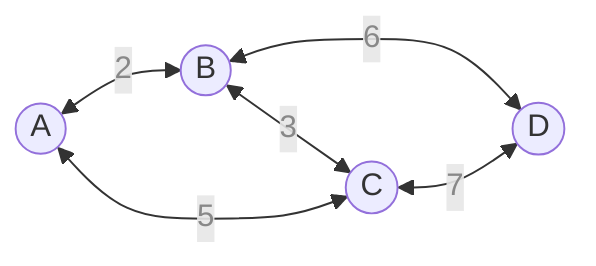
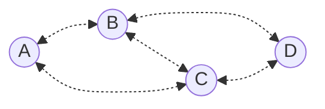
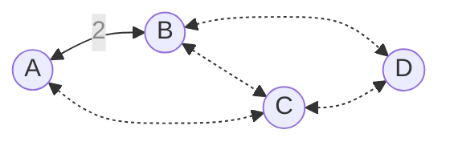
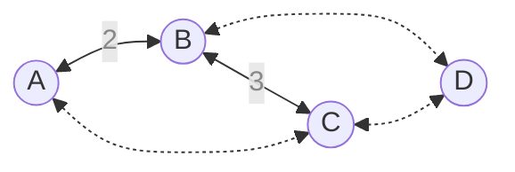
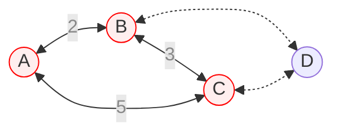
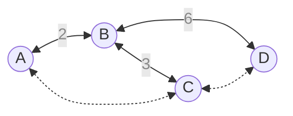
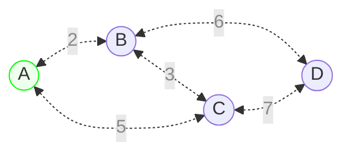
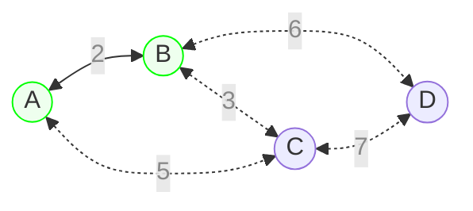
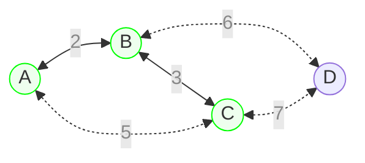
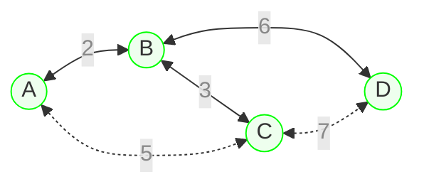

## 소개

최소 신장 트리 문제는 하나의 연결 요소를 가진 양방향 연결 그래프에서 각 간선들의 가중치가 주어졌을 때, 연결 요소를 두 개 이상으로 쪼개지 않으면서 간선들 중 일부를 제거하여 가중치의 총합이 최소가 되도록 하는 문제이다. 그래프에서 정의된 이 문제가 최소 신장 "트리"로 불리는 이유는 정점의 개수가 $V$개인 그래프에서 간선을 최대한 제거했을 때, 간선의 총 개수가 $V-1$개인 트리의 형태를 띨 것이기 때문이다. 만약에 간선의 개수가 $V$개 이상이라면 그래프에 사이클이 필히 발생하고, 이는 그래프에 제거 가능한 불필요한 간선이 있다는 말이다.

## 해결

### 크루스칼

크루스칼 알고리즘은 최소 신장 트리 문제를 탐욕법 매커니즘으로 해결한다. 우선 그래프의 간선을 전부 떼어놓고 가중치가 작은 순으로 정렬한다. 그리고 첫 간선부터 검사하며 그래프에 $V-1$개의 간선이 놓일 때까지 간선을 추가한다. 만약 간선을 추가하다가 사이클이 발생했다면, 해당 간선은 버린다. 예시를 보자.



우선 그래프에서 간선을 전부 떼어낸다. 떼어낸 간선들은 가중치 순으로 정렬한다.



이제 이 그래프에서 가중치가 작은 간선부터 하나씩 추가한다. 제일 먼저 가중치가 2인 정점 $\text A$와 $\text B$ 사이의 간선을 그래프에 추가한다.



그 다음 간선은 가중치가 3인 정점 $\text B$와 $\text C$ 사이의 간선이다.



그 다음 간선은 가중치가 5인 정점 $\text A$와 $\text C$ 사이의 간선이나, 추가할 시 그래프에 사이클이 발생하므로 해당 간선은 버린다.



그 다음 간선은 가중치가 6인 정점 $\text B$와 $\text D$ 사이의 간선이다. 해당 간선을 추가하면서 그래프에 놓이 간선의 개수가 $V-1$개가 되었으므로 여기서 알고리즘을 종료한다.



바로 이 트리가 해당 그래프의 최소 신장 트리인 것이다. 크루스칼 알고리즘은 그래프의 간선의 개수가 $E$개일 때, 간선을 정렬하는 단계에서 $O(E\log E)$의 시간복잡도를, 간선을 그래프에 채택하는 단계에서 $O(E)$의 시간복잡도를 가지므로 총 시간복잡도는 $O(E\log E)$이다.

#### 구현

간선을 채택했을 때 사이클이 발생하는지의 여부는 [분리 집합](/posts/disjoint_set)을 통해서 알아낸다. 간선을 하나씩 검사할 때마다 `find` 연산을 사용해 같은 연결 집합에 존재하는지를 알아낸 후, 같은 연결 집합에 속하지 않았다면 간선의 양 쪽의 연결 집합을 하나의 집합으로 합쳐주면서 진행한다.

```python
# edge는 간선 리스트로, 다음과 같은 형태를 띤다.
# edge[m] = (a, b, cost)
def kruskal(n: int, edge: list[tuple[int, int, int]]) -> list[tuple[int, int, int]]:
    result: list[tuple[int, int, int]] = []
    root = [i for i in range(n)]

    def find(i: int) -> int:
        if root[i] != i:
            root[i] = find(root[i])
        return root[i]

    for a, b, cost in sorted(edge, key=lambda e: e[2]):
        root_a, root_b = find(a), find(b)
        if root_a != root_b:
            root[root_a] = root_b
            result.append((a, b, cost))
            if len(result) == N - 1:
                return result
    raise
```

### 프림

크루스칼 알고리즘이 간선 위주의 알고리즘이었다면, 프림 알고리즘은 정점 위주의 알고리즘이다. 프림 알고리즘은 정점 하나에서 시작하여, 연결 집합에 바로 연결된 간선 중 사이클이 생기지 않으면서 가중치가 최소인 간선을 선택해 연결 집합을 확장해나가는 방식으로 진행된다. 예시를 보자.



먼저 그래프의 아무 정점이나 하나 고르고 시작 정점으로 정한다. 시작 정점과 맞닿아 있는 두 개의 간선 중 가중치가 더 작은 정점 $\text B$와 연결된 간선을 고른다.



간선을 고르면 연결 집합이 $\lbrace\text{A},\text{B}\rbrace$로 확장된다. 이제 확장된 연결 집합과 맞닿아 있는 간선들 중 사이클이 발생하지 않으면서 가중치가 가장 작은 간선을 하나 더 선택한다. 이번에는 가중치가 3인 간선을 선택할 수 있을 것이다.



이러한 방식으로 연결 집합을 확장해나가며 전체 정점을 모두 집합에 포합시킬 때까지 반복한다.



프림 알고리즘을 구현할 때는 대체로 간선을 저장하는 우선순위 큐를 생성한다. 연결 집합이 확장될 때마다 새로 맞닿게 되는 간선들을 우선순위 큐에 삽입하고, 연결 집합에 포함할 새로운 정점을 탐색할 때 우선순위 큐에서 차례대로 간선을 꺼내어 사이클 여부를 확인하고 채택하도록 구성한다. 정점의 개수가 $V$이고 간선의 개수가 $E$인 그래프에서, 간선을 검사하고 우선순위 큐에 삽입 및 추출하는 연산의 총 횟수는 모든 간선을 한 번씩 우선순위 큐에 넣었다가 빼는 것을 감안하더라도 $O(E\log V)$의 시간복잡도가 소요된다. 왜냐하면 우선순위 큐가 가질 수 있는 최대 길이가 $O(V)$에 비례하기 때문이다. 결국 프림 알고리즘의 시간복잡도는 $O(E\log V)$이다.

#### 구현

인자 형식과 반환 형식은 크루스칼 알고리즘과 동일하다.

```python
import heapq

# edge는 간선 리스트로, 다음과 같은 형태를 띤다.
# edge[m] = (a, b, cost)
def prim(n: int, edge: list[tuple[int, int, int]]) -> list[tuple[int, int, int]]:
    result: list[tuple[int, int, int]] = []

    edge_list = [[] for _ in range(n)]
    for a, b, cost in edge:
        edge_list[a].append((b, cost))
        edge_list[b].append((a, cost))

    connected = [False] * n
    connected[0] = True
    pq = [(cost, 0, nxt) for nxt, cost in edge_list[0]]
    heapq.heapify(pq)
    for _ in range(n - 1):
        cost: int
        a: int
        b: int = 0
        while connected[b]:
            cost, a, b = heapq.heappop(pq)
        result.append((a, b, cost))
        connected[b] = True
        for nxt, cost in edge_list[b]:
            if not connected[nxt]:
                heapq.heappush(pq, (cost, b, nxt))
    return result
```