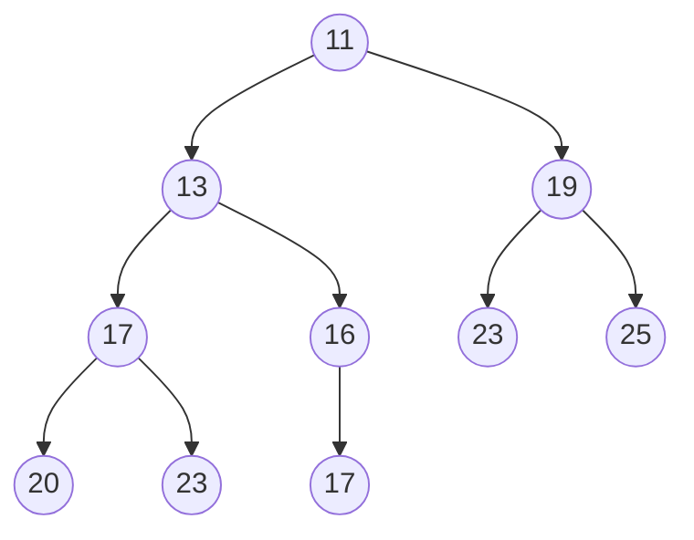
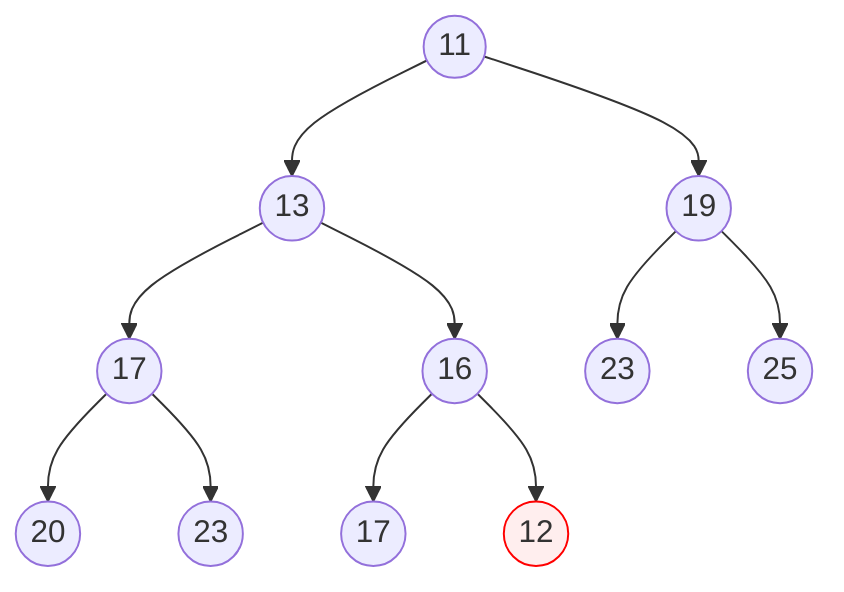
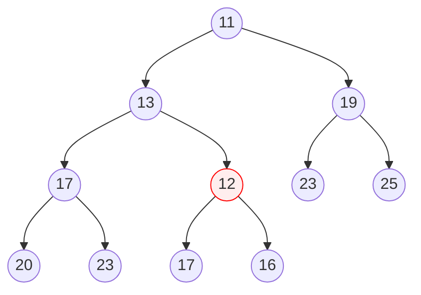
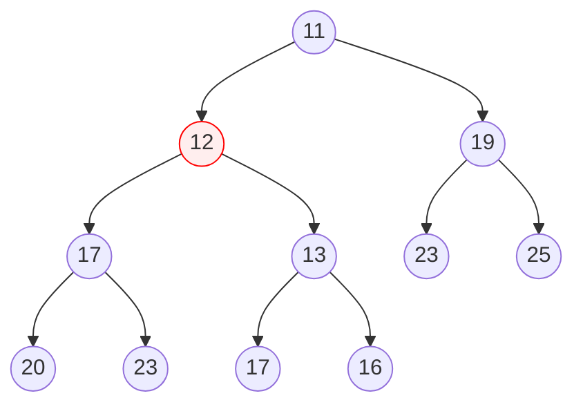
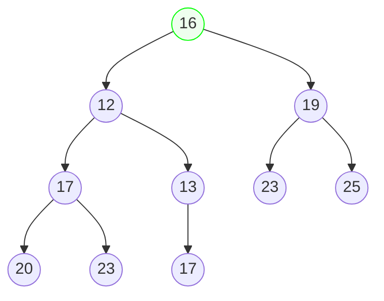
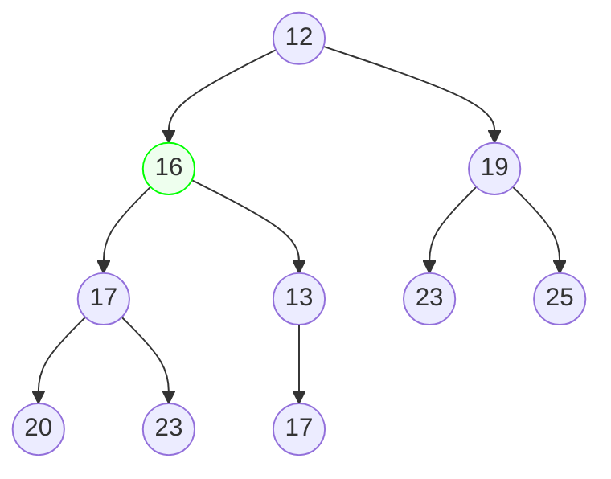
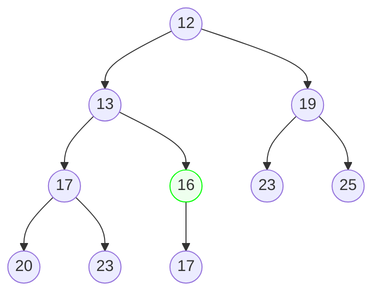
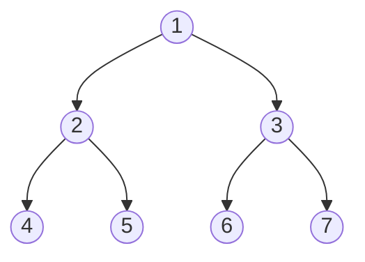

## 소개

큐는 삽입과 추출 연산을 지원하는 자료구조이며 추출의 순서는 먼저 삽입된 순서이다. 우선순위 큐란 추출의 순서가 우선순위가 높은 순서인 큐이다. 우선순위 큐는 힙이라는 특수한 트리를 사용하여 삽입과 삭제 연산을 빠르게 수행하도록 구현한다.

## 원리

우선 힙을 구성한다. 힙은 부모와 자식 사이의 대소 관계가 일정하게 정해진 완전 이진 트리로 정의한다. 부모와 자식 중 부모 정점이 더 크다면 최대 힙, 부모 정점이 더 작다면 최소 힙이라고 한다. 트리의 대소 관계는 우선순위 큐에서 정의하고 싶은 우선순위대로 설정하면 된다. 아래는 최소 힙의 한 예시이며, 이를 통해서 작은 수부터 추출되는 우선순위 큐의 원리를 살펴보려고 한다.



위에서 알 수 있듯이 트리의 어떤 정점도 부모 정점보다 작지 않은 것을 볼 수 있다. 이러한 힙은 우선순위 큐에서 지원하는 삽입과 추출 연산에 최적화되어있다. 두 연산의 원리는 이 트리에 새로운 정점을 추가하거나 트리의 루트를 다른 값으로 대체한 후에 힙의 정의를 다시 만족하도록 조작하는 것이다.

### 삽입

힙에 12를 삽입해보자. 우선 힙의 정의와 상관없이 12를 바로 끝 정점 자리에 삽입한다.



이제 이 트리를 다시 힙의 정의를 만족하도록 수정한다. 우선 정점 12를 부모 정점와 비교하여 힙의 성질을 만족하는 지 검사한다. 만약 힙의 성질을 만족하지 않는다면 해당 정점와 자리를 바꾼다. 현재 이 상황에서는 힙의 성질을 만족하지 않으므로 다음과 같이 자리를 바꾼다.



이를 트리가 힙의 성질을 만족할때까지 반복한다.



위와 같이 트리가 힙의 성질을 만족하게 되면 연산이 끝난다. 결국에는 이 연산은 새로 삽입한 정점이 루트까지 가거나 그 이전에 끝이 날 것이다. 따라서 전체 정점의 개수를 $N$개라고 한다면 이 연산의 시간복잡도는 $O(\log N)$이다.

### 추출

이번에는 힙에서 가장 작은 원소를 제거해보자 (삽입 연산이 완료된 후의 예시를 그대로 인용한다). 가장 작은 원소가 루트에 있다는 사실은 자명하다. 따라서 우선 루트 정점을 제거하고 맨 끝에 있던 정점을 루트의 위치로 옮긴다.



이후 트리가 힙의 성질을 만족하도록 수정한다. 해당 정점와 그의 자식 정점을 비교하고 힙의 성질을 만족하지 않을 경우 자식 정점 중 더 작은 정점와 자리를 바꾼다.



이를 힙의 성질을 만족할때까지 반복한다.



위와 같이 힙의 성질을 만족하게 되면 연산이 끝난다. 결국에는 이 연산도 삽입과 마찬가지로 루트에 삽입한 정점이 리프까지 가거나 그 이전에 끝이 날 것이다. 따라서 추출 연산의 시간복잡도도 $O(\log N)$이다. 이와 같이 힙의 성질을 만족하지 않는 트리를 힙의 성질을 만족하도록 해 주는 것을 힙 정렬이라고 한다.

## 구현

이 글에서는 최소 힙을 바탕으로 작은 수부터 추출되는 우선순위 큐를 구현할 것이다. 힙은 배열로 구현하는 것이 효율적이다. 배열로 구현할 때는 인덱스를 1부터 시작하도록 하는 것이 더 편리하다. 아래 설명 역시 배열의 인덱스가 1부터 시작한다고 가정한다.

|  1  |  2  |  3  |  4  |  5  |  6  |  7  |
| --- | --- | --- | --- | --- | --- | --- |
|     |     |     |     |     |     |     |

위와 같은 배열은 다음과 같은 트리와 대응된다.



신기하게도 $i$번 정점의 자식은 $2i$, $2i + 1$번이다. 이러한 특성은 힙이 완전 이진 트리이기에 가능한 것이다. 따라서 인덱스가 $i$인 정점의 왼쪽 자식의 인덱스는 $2i$, 오른쪽 자식의 인덱스는 $2i + 1$, 부모의 인덱스는 $i/2$임을 이용해 삽입과 추출을 구현할 수 있다.

```python
class PriorityQueue:
    def __init__(self, array: list[int] = []):
        self.array = [0]
        for v in array:
            self.push(v)

    # 삽입
    def push(self, n: int):
        now = len(self.array)
        self.array.append(n)
        while now != 1 and self.array[now >> 1] > self.array[now]:
            self.array[now >> 1], self.array[now] = self.array[now], self.array[now >> 1]
            now >>= 1

    # 추출
    def pop(self) -> int:
        result = self.array[1]
        self.array[1] = self.array[-1]
        self.array.pop()
        now = 1
        while now < len(self.array):
            min_child = now
            for child in [now << 1, (now << 1) + 1]:
                if child < len(self.array) and self.array[min_child] > self.array[child]:
                    min_child = child
            if min_child == now:
                break
            self.array[min_child], self.array[now] = self.array[now], self.array[min_child]
            now = min_child
        return result

    # 최솟값 확인
    def peak(self) -> int:
        return self.array[1]

    # 비었는지 확인
    def empty(self) -> bool:
        return len(self.array) == 1
```

두 연산 모두 현재의 정점을 가리키는 변수 `now`를 두고 각각 자식 또는 부모 정점와 값을 비교하며 위아래로 움직이는 모양새를 하고 있다.

## 이용

우선순위 큐를 이용할 때 번거롭게 매번 구현하는 행위를 없애기 위해 많은 언어에서 기본으로 제공하는 라이브러리를 통해 우선순위 큐를 제공하고 있다.

| 언어 | 라이브러리 포함 구문 |
| --- | --- |
| C++    | `#include <queue>`               |
| Java   | `import java.util.PriorityQueue` |
| Python | `import heapq`                   |

이들을 사용하기 위해서는 우선순위 큐에 들어가는 원소의 대소 비교가 가능해야 한다. 따라서 해당 언어에서 지원하는 방법으로 원소롤 사용할 자료형의 비교 연산을 오버라이드하거나 우선순위 큐를 선언할 때 비교 정책을 같이 선언해 주는 것이 필요하다.