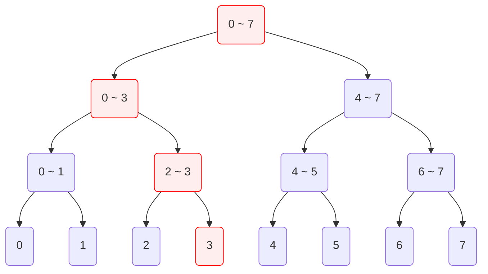
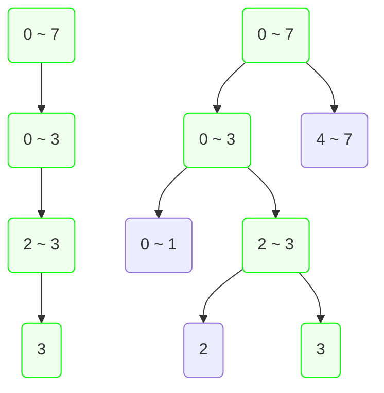
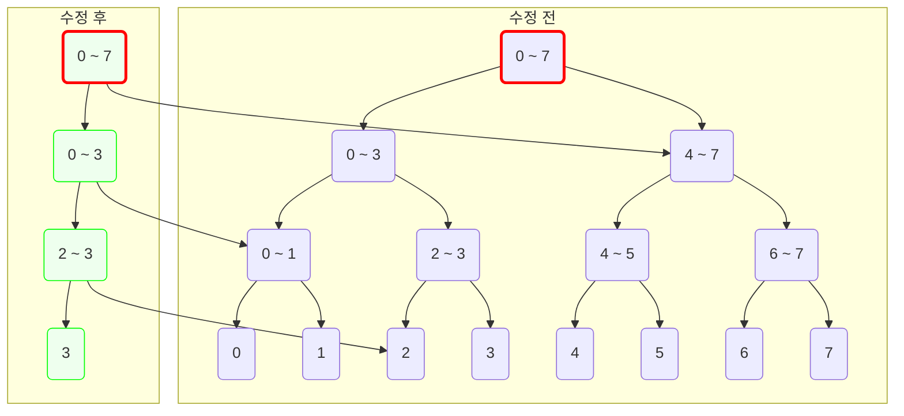
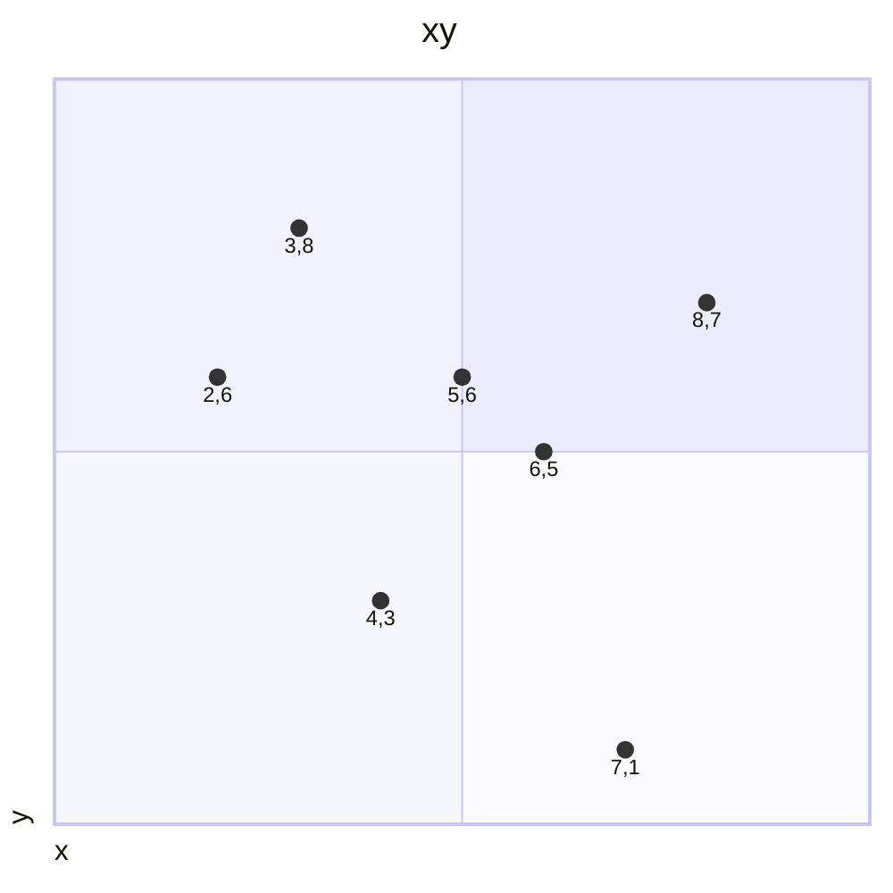

## 소개

퍼시스턴트 세그먼트 트리란 매 수정 쿼리마다 트리의 상태를 덮어쓰지 않고 모두 저장하고 있는 세그먼트 트리를 말한다. 이러한 특성 때문에 퍼시스턴트 세그먼트 트리는 주로 2차원 상에서의 세그먼트 트리를 구현하기 위해서 많이 쓰인다.

## 원리

아래와 같이 크기가 8인 배열을 관리하는 세그먼트 트리에서 3번 인덱스의 값을 바꾸는 연산을 수행할 것이다. 기존의 세그먼트 트리는 3번 인덱스를 가리키는 리프 정점의 모든 조상 정점의 값을 갱신해주었다.



하지만 퍼시스턴트 세그먼트 트리는 정점의 값을 수정하지 않는다. 퍼시스턴트 세그먼트 트리에서는 새로운 값을 지닌 정점을 새로 만들어 연결해준다. 우선 새로운 루트 정점을 생성하고 3번 인덱스를 가리키는 리프 정점까지 새로운 값으로 만들어준다. 그 후 만들어준 정점들과 기존에 있던 정점들을 대응되는 자리에 연결해준다.



이 결과 세그먼트 트리의 루트 정점이 두 개가 된다. 하나는 인덱스 수정 쿼리가 처리되기 전의 루트이며, 다른 하나는 쿼리 처리 후의 루트이다. 각각의 루트 정점을 통해서 우리는 세그먼트 트리의 쿼리 처리 전의 상태와 처리 후의 상태를 모두 들여다볼 수 있게 되었다.



## 구현

어떠한 시점에서의 구간 합을 구해주는 퍼시스턴트 세그먼트 트리를 구현해보자. 퍼시스턴트 세그먼트 트리의 구현은 기존의 세그먼트 트리에서 인덱스 수정 함수의 메커니즘을 바꾼 것이다. 퍼시스턴트 세그먼트 트리에서는 루트 정점이 여러개가 발생하기 때문에 이를 관리해주는 배열을 선언할 필요가 있다. 우선 기존 세그먼트 트리의 정점 클래스에서 생성자 및 구간 합 함수는 그대로 가져온다.

```python
class Node:
    def __init__(self, array: list[int], l: int, r: int):
        self.left: Node or None = None
        self.right: Node or None = None
        self.value = array[l]
        if r - l > 1:
            m = (l + r) // 2
            self.left = Node(array, l, m)
            self.right = Node(array, m, r)
            self.value = self.left.value + self.right.value

    def get_sum(self, i: int, j: int, l: int, r: int) -> int:
        if i <= l and r <= j:
            return self.value
        elif not (r <= i or j <= l):
            m = (l + r) // 2
            return self.left.get_sum(i, j, l, m) + self.right.get_sum(i, j, m, r)
        else:
            return 0
```

그 후 인덱스 수정 함수에는 정점 자신의 값을 수정하는 대신에, 새로 만든 정점에 자식들을 연결시키고 값을 수정해준 뒤 완성된 정점을 반환하는 방식으로 바꿔주면 된다. 이 함수를 호출하면 인덱스 수정 쿼리가 처리된 후의 상태를 가진 루트 정점이 반환이 된다.

```python
# class Node:
    def modify(self, index: int, value: int, l: int, r: int) -> 'Node':
        # 새로운 정점 생성
        new_node = Node([value], 0, 1)
        if r - l > 1:
            m = (l + r) // 2
            # 재귀 및 기존 정점와 연결
            if index < m:
                new_node.left = self.left.modify(index, value, l, m)
                new_node.right = self.right
            else:
                new_node.left = self.left
                new_node.right = self.right.modify(index, value, m, r)
            # 자신의 값을 수정하는 대신 새로 만든 정점의 값을 수정해줌
            new_node.value = new_node.left.value + new_node.right.value
        return new_node
```

아래는 위에서 완성한 세그먼트 트리의 정점 클래스를 외부 클래스로 한 번 더 감싸 구현을 완료한 것이다.

```python
class SegmentTree:
    class Node:
        def __init__(self, array: list[int], l: int, r: int):
            self.left: SegmentTree.Node or None = None
            self.right: SegmentTree.Node or None = None
            self.value = array[l]
            if r - l > 1:
                m = (l + r) // 2
                self.left = SegmentTree.Node(array, l, m)
                self.right = SegmentTree.Node(array, m, r)
                self.value = self.left.value + self.right.value

        def get_sum(self, i: int, j: int, l: int, r: int) -> int:
            if i <= l and r <= j:
                return self.value
            elif not (r <= i or j <= l):
                m = (l + r) // 2
                return self.left.get_sum(i, j, l, m) + self.right.get_sum(i, j, m, r)
            else:
                return 0

        def modify(self, index: int, value: int, l: int, r: int) -> 'SegmentTree.Node':
            new_node = SegmentTree.Node([value], 0, 1)
            if r - l > 1:
                m = (l + r) // 2
                if index < m:
                    new_node.left = self.left.modify(index, value, l, m)
                    new_node.right = self.right
                else:
                    new_node.left = self.left
                    new_node.right = self.right.modify(index, value, m, r)
                new_node.value = new_node.left.value + new_node.right.value
            return new_node

    # 생성자
    def __init__(self, array: list[int]):
        self.size = len(array)
        self.root = [SegmentTree.Node(array, 0, len(array))]

    # 구간 쿼리, 시점 t를 같이 입력받음
    def get_sum(self, t: int, i: int, j: int) -> int:
        return self.root[t].get_sum(i, j, 0, self.size)

    # 원소 갱신
    def modify(self, index: int, value: int):
        self.root.append(self.root[-1].modify(index, value, 0, self.size))

```

위 클래스 인스턴스에서 구간 합을 구하는 함수 `get_sum`에 시점 `t`를 같이 입력하여 해당 시점에서의 구간 합을 구할 수 있다.

## 응용

퍼시스턴트 세그먼트 트리를 사용하면 다음 문제를 풀 수 있다.

> $xy$ 평면에 여러 점들이 있다. 점들의 좌표는 모두 정수이다. 이에 다음 명령을 처리하는 프로그램을 작성하시오.
>
> `x1 y1 x2 y2`: $\lbrace \left(x, y\right) \|$`x1`$\le x <$`x2`$\land$`y1`$\le y <$`y2`$\rbrace$ 영역에 속하는 점의 개수를 출력한다.



주어진 평면의 $x$축을 시간축으로 보자. $y$축 크기만큼의 배열을 퍼시스턴트 세그먼트 트리로 관리하며 처음($t=0$)에는 배열의 값을 전부 0으로 초기화한다. 점들을 시간($x$ 좌표값)순으로 나열하고 이 순서대로 점들의 $y$ 좌표에 해당하는 인덱스에 더하기 1을 해준다. 위의 예시의 경우 7개의 점에 대해 각각 $t$번째 점마다 트리에 다음과 같은 상태들이 저장될 것이다.


| $y$   | 0 | 1 | 2 | 3 | 4 | 5 | 6 | 7 | 8 | 9 |
| ---   | - | - | - | - | - | - | - | - | - | - |
| $t=0$ |   |   |   |   |   |   |   |   |   |   |
| $t=1$ |   |   |   |   |   |   | 1 |   |   |   |
| $t=2$ |   |   |   |   |   |   | 1 |   | 1 |   |
| $t=3$ |   |   |   | 1 |   |   | 1 |   | 1 |   |
| $t=4$ |   |   |   | 1 |   |   | 2 |   | 1 |   |
| $t=5$ |   |   |   | 1 |   | 1 | 2 |   | 1 |   |
| $t=6$ |   | 1 |   | 1 |   | 1 | 2 |   | 1 |   |
| $t=7$ |   | 1 |   | 1 |   | 1 | 2 | 1 | 1 |   |

이렇게 관리를 하게 되면 시점 $t$에서의 $\left[l, r\right)$ 범위의 구간 합은 $x$ 좌표값 순으로 $t$번째의 점과 그 왼쪽에 있는 점들 중에서 $y$ 좌표가 $\left[l, r\right)$ 범위 안에 있는 모든 점들의 개수가 된다. 예시로, $t=6$에서의 $\left[4, 8\right)$ 범위의 구간 합은 다음 그림의 빨간 영역에 걸쳐있는 점의 개수이다.


이제 이 퍼시스턴트 세그먼트 트리를 바탕으로 쿼리를 처리해보자. `3 4 7 8`의 답은 무엇일까? $x$ 좌표가 $\left[3, 7\right)$ 범위에 속해있는 점들 중 $x$ 좌표값 순으로 가장 뒤에 있는 점은 $(6, 5)$(5번째 점)이다. 그리고 $x$ 좌표가 $\left[3, 7\right)$ 범위의 왼쪽, 즉 3보다 작은 점들 중 $x$ 좌표값 순으로 가장 뒤에 있는 점은 $(2, 6)$(1번째 점)이다. 따라서 정답은 시점 $t=5$에서의 $\left[4, 8\right)$ 구간 합에서 시점 $t=1$에서의 $\left[4, 8\right)$ 구간 합을 뺌으로서 구할 수 있다. 


퍼시스턴트 세그먼트 트리를 이용하면 위 문제의 명령을 $O(\log N)$의 시간복잡도로 해결할 수 있다.