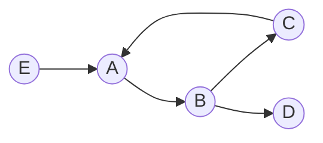
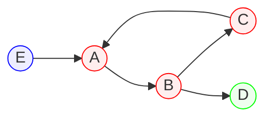
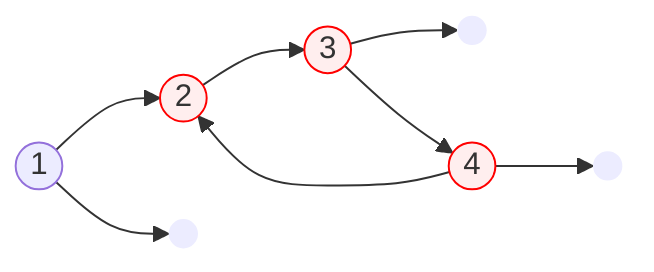
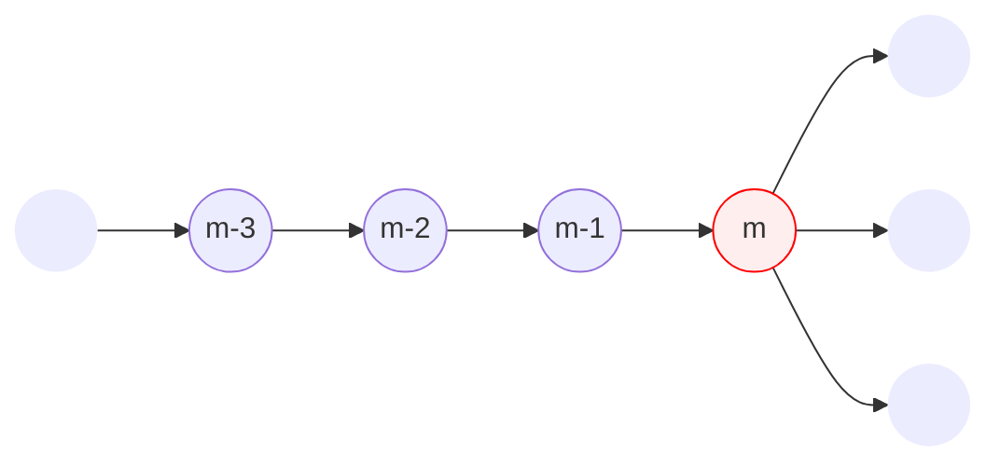
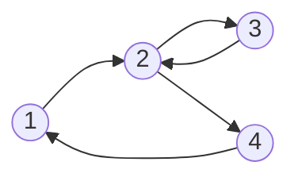
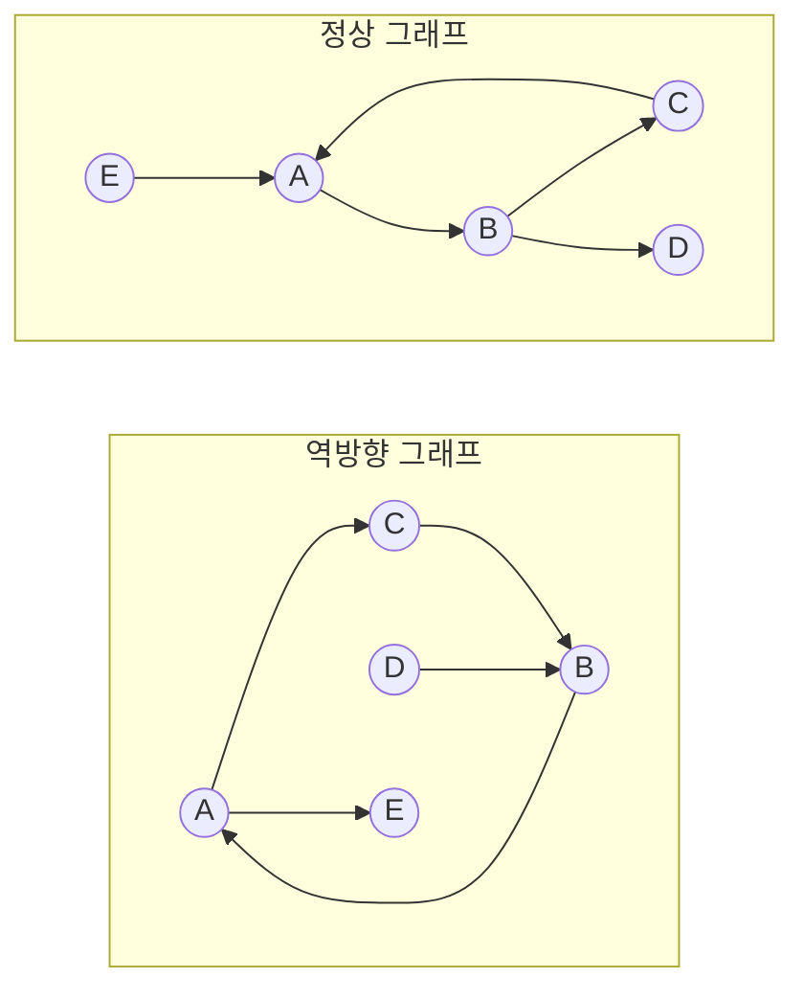
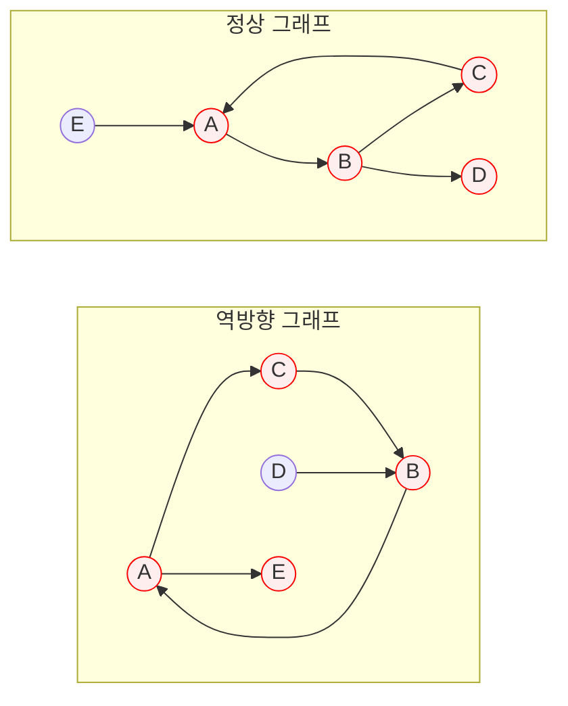
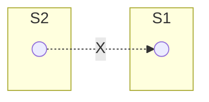

## 소개

강한 연결이라는 개념은 방향 그래프에서 정의된다. 방향 그래프의 어떠한 두 정점이 강하게 연결되었다는 것은 서로가 서로에게 도달 가능하다는 것을 의미한다. 강한 연결 요소란 방향 그래프의 부분 그래프이며, 부분 그래프 내의 모든 정점이 서로 강하게 연결되어 있으면서 그 크기가 최대인 그래프를 말한다. 다음 그래프에서 강한 연결 요소를 찾아보자.



정점 $\text A$, $\text B$, $\text C$는 서로가 서로에게 가는 경로가 존재하므로 하나의 강한 연결 요소를 이룬다. 정점 $\text E$와 $\text D$는 자기 자신과 강하게 연결된 다른 정점이 존재하지 않지만, 그 자체로도 하나의 강한 연결 요소를 이룬다. 따라서 위 그래프에서 강한 연결 요소는 3개이며 다음과 같다.



## 탐색

### 타잔

그래프에 사이클이 존재한다면, 사이클에 속하는 모든 정점은 서로 강하게 연결되어 있다. 왜냐하면 사이클의 어떠한 임의의 두 정점을 잡더라도 서로가 서로에게 가는 경로가 사이클상에서 존재하기 때문이다. 타잔 알고리즘은 이를 이용하여 그래프에서 사이클을 검출하고 이를 하나의 강한 연결 요소로 묶는다. 사이클은 어떻게 찾을 수 있을까?



사이클의 핵심은 해당 정점에서 출발해 다시 돌아올 수 있다는 것이다. 만약 그래프에서 DFS를 진행하다가 DFS 스택상에 있는 어떠한 정점을 다시 돌아오게 된다면 해당 스택의 위치부터 가장 최근 방문 정점까지는 사이클을 이룬다고 할 수 있다. 위 예시에서 정점에 써진 숫자는 DFS 방문 순서를 나타낸다. 4번 정점에서 DFS 순서상으로 앞인 2번 정점으로 방문이 가능하므로, 2번 정점부터 4번 정점까지는 사이클이라고 판단할 수 있다.



> DFS 스택: $[..., m-3, m-2, m-1, m]$

위 예시와 같이 현재 DFS 깊이가 $m$번째인 정점에 있고, 아직 방문하지 않은 정점 3개가 바로 연결되어 있다고 가정하자. 다음 3개의 정점에 대해서도 재귀적인 DFS를 수행하였고, 결과가 각각 다음과 같았다고 하자.

1. $m-3$번째 정점을 다시 방문할 수 있었음.
2. $m-2$번째 정점을 다시 방문할 수 있었음.
3. $m-1$번째 정점을 다시 방문할 수 있었음.

DFS가 수행되고 다시 $m$번째 정점으로 돌아와 위 결과를 가지고 사이클 여부를 결정할 때, 어떤 정점을 기준으로 사이클의 범위을 정해야 할까? 당연히 DFS 스택 상으로 가장 먼저 쌓인 정점인 $m-3$번째 정점으로 정해야 할 것이다. 그렇게 하면 자연스럽게 DFS 스택 상의 바깥쪽 정점들을 사이클 안으로 포함할 수 있기 때문이다. 이러한 결정을 내리기 위해서는 각 정점마다 DFS 방문 순서를 기록하고 있어야 한다.

타잔 알고리즘은 DFS 기반의 알고리즘이므로, 정점의 개수가 $V$인 그래프에서 $O(V)$의 시간복잡도를 가진다.

#### 구현

```python
class Node:
    def __init__(self, index: int):
        self.index = index
        self.next: list['Node'] = []
        self.visited = False  # 방문된 정점인가?
        self.in_stack = False  # 현재 DFS 스택 상에 존재하는가?
        self.depth = 0  # DFS 방문 깊이
        self.scc_root = self  # DFS 상으로 재방문 가능하면서 depth가 가장 작은 정점

    # scc_root 값을 얻고자 할 때 호출해야 하는 함수
    # scc_root에 대한 직접 접근은 금지된다.
    def get_root(self) -> 'Node':
        if self.scc_root is not self:
            self.scc_root = self.scc_root.get_root()
        return self.scc_root

    def dfs(self):
        self.in_stack = True
        self.visited = True
        for next_node in self.next:
            if not next_node.visited:
                next_node.depth = self.depth + 1
                next_node.dfs()
            root = next_node.get_root()
            if root.in_stack and root.depth < self.scc_root.depth:
                self.scc_root = root
        self.in_stack = False
```

위는 타잔 알고리즘 수행 시 정점마다 저장해야 할 변수들을 바탕으로 구성한 정점 클래스이다. `dfs` 함수를 통해 DFS를 수행하면서 DFS 스택 상에서 재방문 가능한 정점을 탐색하고 가장 `depth`가 낮은 정점을 `scc_root` 변수에 저장한다. `scc_root`가 같은 정점들은 같은 사이클에 있는 정점들일 것이며, 그러므로 같은 강한 연결 요소에 속한다고 판별할 수 있을 것이다. `scc_root` 변수에 접근할 때는 무조건 `get_root` 함수를 이용해야 하는데, 이유는 다음과 같다.



위 예시에서 각 정점에 쓰인 숫자는 DFS 방문 순서이다. 한 눈에 알 수 있듯이 위 그래프는 모든 정점이 하나의 강한 연결 요소에 속한다. 각 정점은 DFS 수행이 끝나면 `scc_root` 변수에 DFS 방문 스택 상에서 가장 안쪽 정점이 저장된다고 하였다. 그렇다면 3번째로 방문되었던 정점은 `scc_root` 변수에 어떤 정점이 저장되어 있을까?

||1번째 정점|2번째 정점|3번째 정점|4번째 정점|
|---|---|---|---|---|
|`visited`|`True`|`True`|`True`|`True`|
|`in_stack`|`False`|`False`|`False`|`False`|
|`depth`|`0`|`1`|`2`|`2`|
|`scc_root`|1번째 정점|1번째 정점|2번째 정점|1번째 정점|

위는 DFS 수행이 완전히 종료되고 난 뒤의 상태를 나타낸 것이다. 3번째 정점에는 코드를 수행하였을 때 아마도 2번째 정점이 `scc_root`에 저장될 것이다. 이에 반해 다른 정점들은 DFS가 끝나면 `scc_root` 변수에 1번째 정점이 저장되어 있을 것이다. 우리는 분명 같은 강한 연결 요소라면 같은 `scc_root`를 가질 것이라는 추측을 하였는데, 이에 반하는 결과가 나올 수 있는 것이다. 

||1번째 정점|2번째 정점|3번째 정점|4번째 정점|
|---|---|---|---|---|
|`visited`|`True`|`True`|`True`|`False`|
|`in_stack`|`True`|`True`|`True`|`False`|
|`depth`|`0`|`1`|`2`|`0`|
|`scc_root`|1번째 정점|1번째 정점|2번째 정점|4번째 정점|

 위 표는 3번 정점까지 DFS를 종료했을 때의 상태를 나타낸 것이다. 3번 정점은 2번 정점밖에 연결된 것이 없기에 `scc_root` 변수가 2번쨰 정점을 가리키면서 끝나게 된 것이다. 이를 해결하는 핵심은 `scc_root` 또한 또 다른 `scc_root`를 가질 수 있다는 점을 이용하는 것이다. 따라서 `scc_root`에 접근할 때는 `scc_root`의 또 다른 `scc_root`가 있는지를 재귀적으로 검사하여 스택의 가장 안쪽 정점을 얻어야 한다. 이를 수행하는 것이 `get_root` 함수인 것이다.

```python
# n은 정점의 개수이다.
# edges는 인접 리스트이다.
def tarjan(n: int, edges: list[tuple[int, int]]) -> list[list[int]]:
    # 정점 생성 및 연결
    nodes = [Node(i) for i in range(n)]
    for a, b in edges:
        nodes[a].next.append(nodes[b])

    # 모든 정점에 대해 DFS 수행
    for node in nodes:
        if not node.visited:
            node.dfs()

    # 같은 scc_root를 가진 정점끼리 그룹화 후 반환
    result: dict[int, list[int]] = {}
    for node in nodes:
        root = node.get_root()
        if root.index not in result:
            result[root.index] = []
        result[root.index].append(node.index)
    return list(result.values())
```

위 `tarjan` 함수는 앞서 정의한 `Node` 클래스를 바탕으로 타잔 알고리즘을 수행한다. 모든 정점에 대해서 DFS 수행이 끝나면, `get_root`가 반환하는 정점이 같은 것끼리 묶어 같은 강한 연결 요소로 묶어 반환한다.

### 코사라주

코사라주 알고리즘은 역방향 그래프를 이용해 강한 연결 요소를 검출한다. 역방향 그래프란 기존에 주어진 방향 그래프의 간선 방향을 전부 뒤집어서 만든 그래프이다.



역방향 그래프는 원래 그래프와 강한 연결 요소가 일치한다는 것은 직관적으로 이해가 간다. 즉, 어떠한 정점 $V_1$가 또 다른 정점 $V_2$에 대해서 원래 그래프와 역방향 그래프 모두에서 도달 가능할 때, $V_1$과 $V_2$은 강하게 연결되었다고 말할 수 있다. 위 예시의 두 그래프에 정점 $\text A$에서 도달 가능한 모든 정점을 표시해보자.



정점 $\text A$, $\text B$, $\text C$는 두 그래프 모두에서 도달 가능한 정점이다. 즉, 이 정점들은 하나의 강한 연결 요소를 이룬다. 코사라주 알고리즘은 이를 이용해 순방향 그래프와 역방향 그래프를 한 번씩 DFS를 수행하여 강한 연결 요소를 추출한다. 코사라주 알고리즘의 절차는 다음과 같으며, 이 절차를 수행하면 무조건 강한 연결 요소가 추출됨이 증명되어 있다. 아래 절차에서 DFS를 탈출한다는 것은 해당 정점과 맞닿아 있는 모든 정점에 재귀적으로 DFS를 완료하고 반환하는 것을 말한다.

> 1. 정점을 저장할 수 있는 스택과 역방향 그래프 준비한다.
> 2. 그래프를 DFS 순회하면서 정점을 탈출할 때마다 해당 정점을 스택에 저장한다.
> 3. 스택에서 정점을 하나씩 꺼내어 그 정점을 시작으로 역방향 그래프에서 DFS를 수행하고 방문한 정점들을 모두 하나의 강한 연결 요소로 묶는다. 만약 스택에서 꺼낸 정점이 이미 방문된 정점이라면 아무것도 하지 않는다. 이 과정을 스택이 빌 때까지 반복한다.

코사라주 알고리즘은 DFS 기반의 알고리즘이므로 정점의 개수가 $V$인 그래프에서 $O(V)$의 시간복잡도를 가진다.

#### 증명

어떻게 이 알고리즘 강한 연결 요소를 추출한다는 것을 보증할 수 있을까? 아래 명제에 대해서 생각해보자.

> 한 그래프의 임의의 서로 다른 강한 연결 요소 $S_1$, $S_2$에 대해서 각각 연결 요소에 속한 정점들의 DFS 탈출 시각 중 최댓값을 $t_1$, $t_2$라 한다면, $t_1 > t_2$일 때 $S_2$에서 $S_1$로 가는 간선은 존재하지 않는다.



$t_1 > t_2$라는 것은 다음 두 가지 경우 중 하나에 속한다.

1. $S_2$를 DFS상으로 먼저 방문했으며, $S_2$에서 $S_1$로 가는 간선이 존재하지 않은 경우
2. $S_1$를 DFS상으로 먼저 방문했으며, $S_1$에서 $S_2$로 가는 간선이 존재했던 경우

1번 경우는 $S_2$에서 $S_1$로 가는 간선이 존재하지 않았던 것이 명확하다. 2번 경우는 $S_2$에서 $S_1$로 가는 간선이 존재할 경우 $S_1$과 $S_2$이 서로 다른 강한 연결 요소라는 기본 가정에 위배된다. 왜냐하면 $S_1$에서 $S_2$로 가는 간선도 존재하고 $S_2$에서 $S_1$로 가는 간선이 존재한다면 $S_1$과 $S_2$의 모든 정점은 서로에게 도달 가능한 경로가 존재하기 때문이다. 따라서 2번의 경우에도 $S_2$에서 $S_1$로 가는 간선이 존재하지 않는다. 1의 경우와 2의 경우 모두 $S_2$에서 $S_1$로 가는 간선이 존재하지 않으므로, 명제가 참임이 증명되었다.

$S_2$에서 $S_1$로 가는 간선이 존재하지 않는다는 명제가 참이므로, 역방향 그래프에서 $S_1$에서 $S_2$로 가는 간선 또한 존재하지 않는다. 다시 말하면 역방향 그래프에서 $S_1$에 있는 정점을 시작으로 DFS를 수행하면, 다른 강한 연결 요소로 진입하지 않고 반드시 같은 강한 연결 요소 내의 정점만을 전부 방문하고 종료한다는 것이다. 우리는 알고리즘의 2번 단계에 의해 생성된 스택에서 순서대로 정점을 꺼내 DFS를 수행하므로, 반드시 $S_1$과 같이 탈출 시점의 최댓값이 큰 강한 연결 요소부터 탐색하게 된다. 따라서 코사라주 알고리즘은 강한 연결 요소를 항상 추출해낼 수 있다.

#### 구현

```python
class Node:
    def __init__(self, index: int):
        self.index = index
        self.next: list['Node'] = []
        self.prev: list['Node'] = []
        self.visited = -1

    def dfs(self, visit_id: int, visit_list: list['Node'], visit_direction: int):
        self.visited = visit_id
        for next_node in [self.next, self.prev][visit_direction]:
            if next_node.visited != visit_id:
                next_node.dfs(visit_id, visit_list, visit_direction)
        visit_list.append(self)


def kosaraju(n: int, edges: list[tuple[int, int]]) -> list[list[int]]:
    # 정점 생성 후 순방향과 역방향 그래프 구축
    nodes = [Node(i) for i in range(n)]
    for a, b in edges:
        nodes[a].next.append(nodes[b])
        nodes[b].prev.append(nodes[a])

    # 스택 구축
    stack: list[Node] = []
    for node in nodes:
        if node.visited != 0:
            post_order: list[Node] = []
            node.dfs(0, post_order, 0)
            stack += post_order

    # 역뱡향 그래프에서 DFS 탐색
    result: list[list[int]] = []
    while stack:
        node = stack.pop()
        if node.visited == 1:
            continue
        scc: list[Node] = []
        node.dfs(1, scc, 1)
        result.append(list(map(lambda x: x.index, scc)))

    return result
```