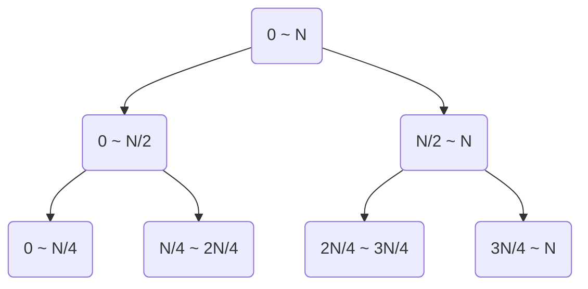
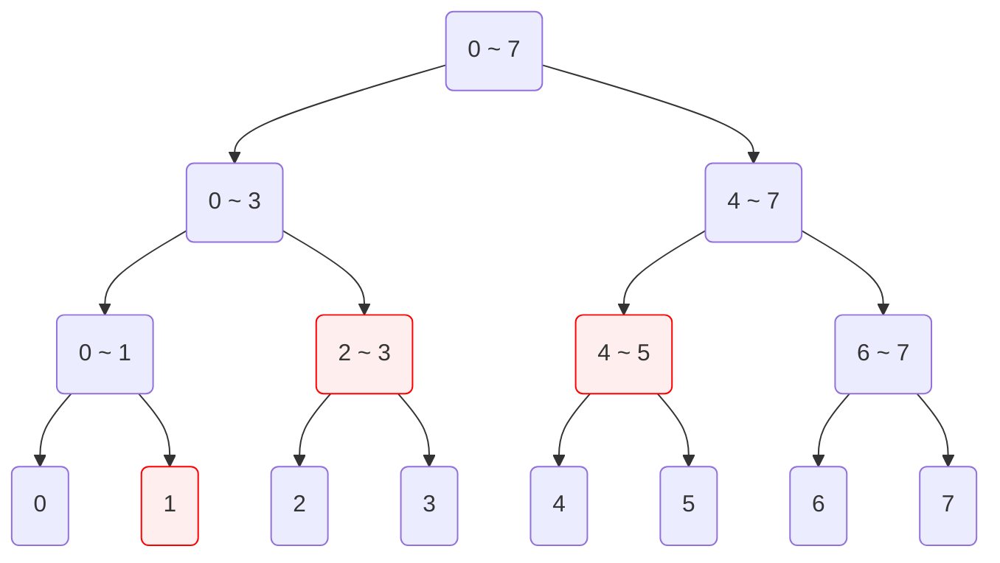
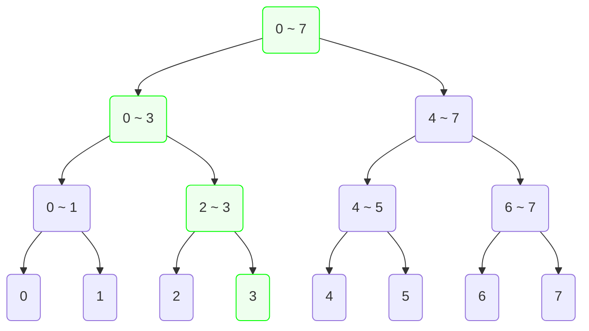

## 소개

### 문제 제시

어떠한 배열이 있다. 이 배열의 길이 $N$은 10만 정도이며 수정도 빈번하게 일어난다. 우리는 배열의 임의의 연속된 구간이 주어지면 그 구간의 합을 출력하는 프로그램을 만들 것이다. 우리가 생각해 볼 수 있는 해결법은 단순히 구간의 시작점에서부터 원소들을 더해 출력하는 것이다. 이 경우 매 쿼리마다 시간복잡도가 $O(N)$가 되므로 적절하지 않다. 누군가가 누적 합을 알고 있다면 이 문제에 적용해볼 수 있을 것이다. 그러나 누적 합 방법은 배열의 수정에 $O(N)$의 시간이 걸리므로 이 역시 적절하지 않다. 이 문제를 더 효율적으로 해결하는 자료구조를 생각해 볼 수 있겠는가?

### 세그먼트 트리

세그먼트 트리는 갱신이 많이 일어나는 배열의 어떤 구간에 대한 연산 결과를 빠르게 구할 수 있는 자료구조이다. 세그먼트 트리가 지원하는 연산의 종류는 다음과 같다.

1. 배열의 임의의 어떤 구간에 대해 연산(합/곱, 최소/최댓값 등)한다.
2. 배열의 임의의 인덱스의 값을 수정한다.

세그먼트 트리의 원리는 전체 구간을 분할하여 여러 구간들에 대한 연산 결과를 미리 트리 형태로 저장해 사용하는 것이다. 일종의 분할 정복 매커니즘을 사용하여 공간을 더 사용하는 대신 시간을 줄이는 것이다.

## 원리

길이가 $N$인 배열의 어떠한 구간 $\left[i, j\right)$에 대해서 그 구간의 모든 원소의 합을 구하는 것을 생각해보자. 만약 $i \le m < j$을 만족하는 어떠한 $m$에 대해서 $\left[i, m\right)$ 구간의 합과 $\left[m, j\right)$ 구간의 합을 미리 알고 있었다면 간단히 그 둘을 더하는 것으로 해당 구간의 합을 구할 수 있다. 우리는 이것을 이용하기 위해 여러 구간들의 합을 미리 계산해 놓을 것이다.



먼저 우리가 전 범위 $\left[0, N\right)$ 구간의 합을 구한다고 생각하자. $\left[0, N\right)$ 구간의 합을 구하기 위해 좌측 절반과 우측 절반의 합을 구하고, 좌측 절반의 합을 구하기 위해 그 범위의 좌측 절반과 우측 절반을 구하는 방식으로 모든 구간에 대해 반복한다. 이것은 구간의 크기가 1이 되어 더이상 절반으로 나눌 수 없을 때까지 반복될 것이다. 이러한 행위는 위 그림처럼 트리로 나타낼 수 있다. 이 트리가 우리가 살펴보고 있는 세그먼트 트리이다.

### 구간 쿼리

이렇게 트리를 구성하면 임의의 구간의 합을 특별한 방식으로 구할 수 있다. 이해를 돕기 위해 $N = 8$인 예시를 생각해보자. 각 정점들은 해당 구간의 합을 저장하고 있다.



만약 1 ~ 5에 해당하는 구간의 합을 구하려면 어떤 정점을 조사하면 될까? 위 그림의 3개의 빨간색 정점들의 합을 조사하면 것이다. 빨간색 정점에 도달하기 위해서는 트리의 루트에서부터 정점이 나타내는 구간을 바탕으로 DFS를 수행하면 된다. 사실 어떠한 구간을 잡더라도 우리가 조사해야 할 정점의 개수는 $2\log_{2}{N} - 2$을 넘지 않으며, DFS를 통해서 지나온 정점까지 포함하여 계산할 경우 조사할 정점 개수의 최댓값은 $4\log_{2}{N} + \alpha$의 형태를 띤다. 결국 세그먼트 트리를 사용하여 어떠한 구간에 대한 값을 구하는 쿼리의 시간복잡도는 $O(\log N)$이며 이는 구간의 모든 원소를 일일히 참조해 계산하는 시간보다 적다.

### 원소 갱신

이제 배열에서 원소 하나를 갱신하는 상황을 살펴보자. 만약 3번 인덱스의 값을 수정한다면 3번 인덱스를 범위에 포함하는 정점들도 같이 갱신해주어야 할 것이다.



위 그림의 초록색 정점들이 수정 대상이다. 이들은 루트 정점부터 3번 인덱스를 표현하는 리프 정점까지의 경로와 같다. 이들을 갱신하는데는 트리의 높이만큼의 시간이 소요되므로 세그먼트 트리에서 임의의 인덱스의 값을 수정하는 연산의 시간복잡도는 $O(\log N)$이다.

## 구현

세그먼트 트리를 구현해보자. 이 글에서는 구간 합을 계산하는 세그먼트 트리를 구현할 것이며, 구간 곱이나 구간 최댓값과 같은 연산을 지원하는 세그먼트 트리 역시 얼마든지 응용하여 구현할 수 있다. 우리가 구현해야 할 것은 세 가지 함수이다. 

1. 트리 구축 생성자
2. 구간 쿼리 함수
3. 인덱스 갱신 함수

세 가지 기능 모두 재귀 함수를 이용한 DFS를 실행하는 함수이다.

### 트리 구축

먼저 주어진 배열을 가지고 초기 세그먼트 트리를 구축해야 한다. 이는 재귀 함수를 이용해 루트 정점부터 각 정점의 구간을 정해주면서 전개한다. 아래 코드에서는 해당 정점이 나타내는 구간 $\left[l, r\right)$에 대해 중간값 $m$을 기준으로 왼쪽 범위와 오른쪽 범위의 정점을 가리키는 변수 `left`와 `right`에 새로운 정점을 만들어 할당해주고 있다. 자식 정점의 생성자를 호출할 때 해당 자식 정점이 나타내는 범위를 인자로 주고 있다.

```python
class Node:
    def __init__(self, array: list[int], l: int, r: int):
        if r - l > 1:
            m = (l + r) // 2
            self.left = Node(array, l, m)
            self.right = Node(array, m, r)
            self.value = self.left.value + self.right.value
        else:
            self.value = array[l]
```

### 구간 쿼리

구간 쿼리를 처리하는 함수도 마찬가지로 연산 결과를 구해야 하는 구간 정보와 함께 해당 정점이 나타내는 범위를 인자로 물려주면서 재귀한다. 연산의 대상이 되는 구간 $\left[i, j\right)$과 현재 정점이 나타내는 구간 $\left[l, r\right)$에 대해서 다음과 같이 3가지 경우가 나온다.

1. $\left[l, r\right)$ 구간이 $\left[i, j\right)$ 구간 안에 포함되는 경우
2. $\left[l, r\right)$ 구간이 $\left[i, j\right)$ 구간에 포함되진 않지만 걸쳐있는 경우
3. $\left[l, r\right)$ 구간과 $\left[i, j\right)$ 구간이 겹치지 않는 경우

1의 경우 정점 자기 자신의 값을 돌려주면 되며, 2의 경우 재귀를 통해 자신의 구간의 연산 값을 구해 돌려주어야 하며, 3의 경우 자기 자신을 연산에 포함시키지 않으면 된다.

```python
# class Node:
    def get_sum(self, i: int, j: int, l: int, r: int) -> int:
        if i <= l and r <= j:
            return self.value
        elif not (r <= i or j <= l):
            m = (l + r) // 2
            return self.left.get_sum(i, j, l, m) + self.right.get_sum(i, j, m, r)
        else:
            return 0
```

### 원소 갱신

특정 원소를 갱신하는 함수도 마찬가지로 인덱스 번호, 수정할 값과 함께 해당 정점이 나타내는 범위를 인자로 물려주면서 재귀한다. 양 쪽 자식 정점 중 인덱스 번호를 포함하고 있는 방향으로 재귀 호출을 해준다. 리프 정점에서 값을 교체한 후 재귀를 반환하면서 정점들의 값을 갱신해준다.

```python
# class Node:
    def modify(self, index: int, value: int, l: int, r: int):
        if r - l > 1:
            m = (l + r) // 2
            if index < m:
                self.left.modify(index, value, l, m)
            else:
                self.right.modify(index, value, m, r)
            self.value = self.left.value + self.right.value
        else:
            self.value = value
```

### 전체 구현

아래 코드는 전체 코드이다. 위에서 구현한 `Node` 클래스를 외부 클래스로 한 번 더 감싼 것이다.

```python
class SegmentTree:
    class Node:
        def __init__(self, array: list[int], l: int, r: int):
            if r - l > 1:
                m = (l + r) // 2
                self.left = SegmentTree.Node(array, l, m)
                self.right = SegmentTree.Node(array, m, r)
                self.value = self.left.value + self.right.value
            else:
                self.value = array[l]

        def get_sum(self, i: int, j: int, l: int, r: int) -> int:
            if i <= l and r <= j:
                return self.value
            elif not (r <= i or j <= l):
                m = (l + r) // 2
                return self.left.get_sum(i, j, l, m) + self.right.get_sum(i, j, m, r)
            else:
                return 0

        def modify(self, index: int, value: int, l: int, r: int):
            if r - l > 1:
                m = (l + r) // 2
                if index < m:
                    self.left.modify(index, value, l, m)
                else:
                    self.right.modify(index, value, m, r)
                self.value = self.left.value + self.right.value
            else:
                self.value = value

    # 생성자
    def __init__(self, array: list[int]):
        self.size = len(array)
        self.root = SegmentTree.Node(array, 0, len(array))

    # 구간 쿼리
    def get_sum(self, i: int, j: int) -> int:
        return self.root.get_sum(i, j, 0, self.size)

    # 원소 갱신
    def modify(self, index: int, value: int):
        self.root.modify(index, value, 0, self.size)
```