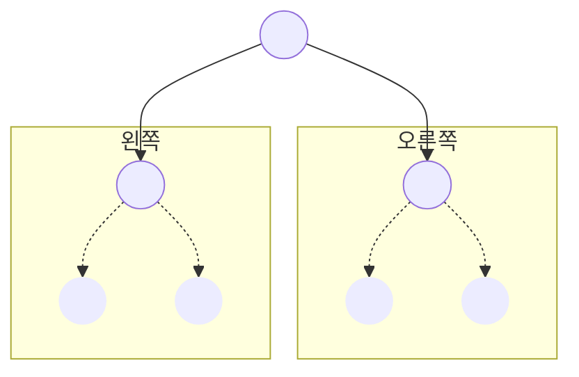
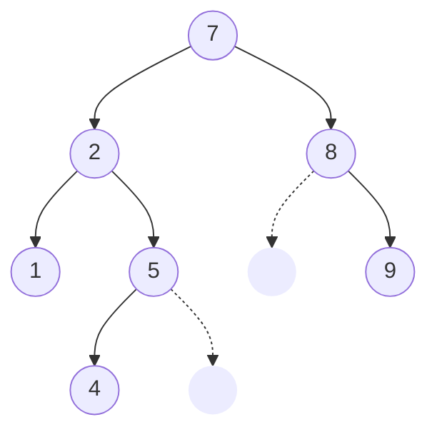
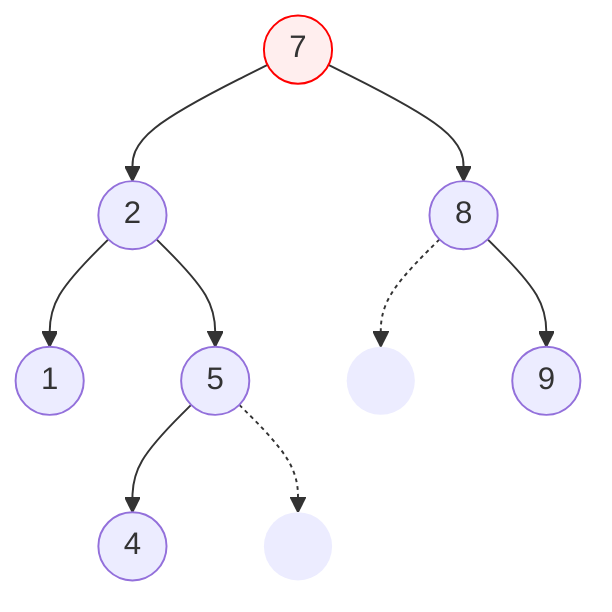
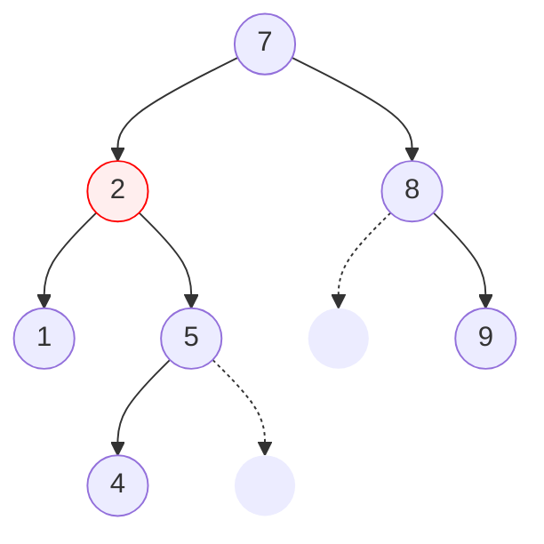
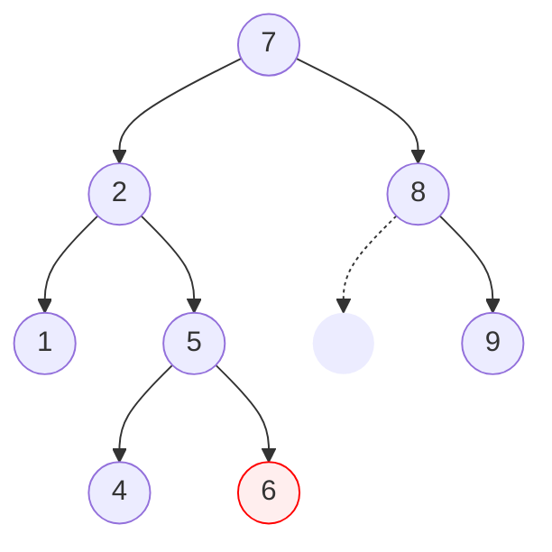
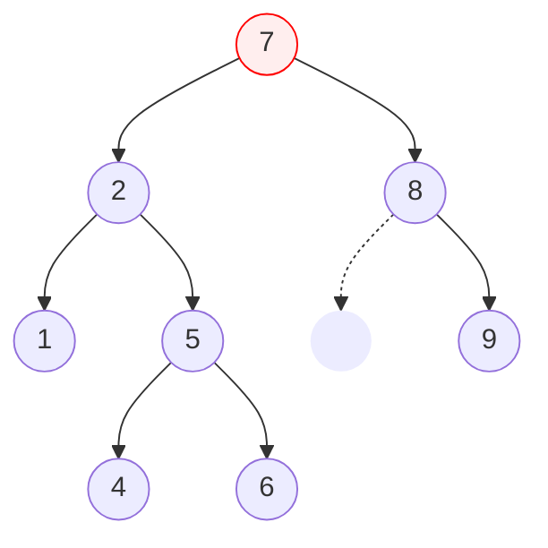
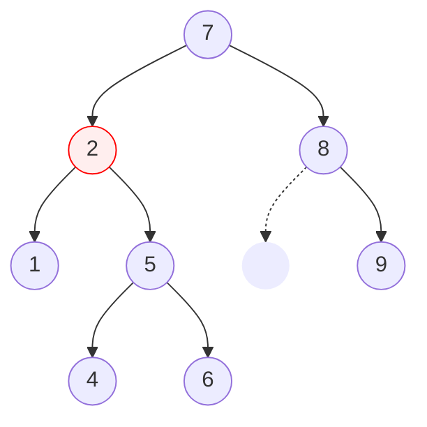
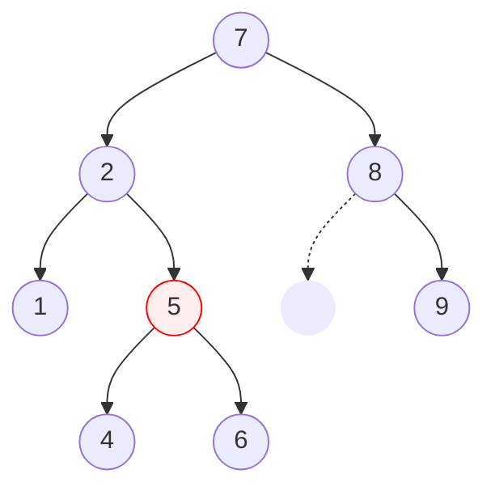
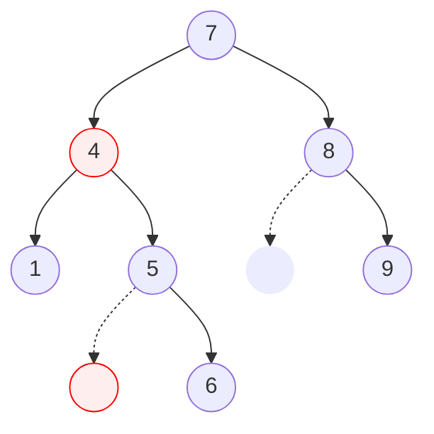

## 소개

집합은 중복을 허용하지 않고 원소의 삽입과 삭제, 그리고 집합에 특정 원소가 속하는지를 검사하는 연산을 지원하는 자료구조이며, 맵은 키를 중복 없이 관리하여 키-값 쌍을 저장하고 조회하는 자료구조이다. 즉 집합과 맵은 다음 연산을 지원하는 자료구조이다.

1. 값(키-값 쌍)의 삽입 및 덮어쓰기
2. 값(키-값 쌍)의 조회
3. 값(키-값 쌍)의 삭제

집합과 맵 자료구조를 구현하는 방법은 크게 트리를 이용한 것과 해시를 이용한 것이 있다. 그 중 트리를 이용한 집합 및 맵 자료구조는 이진 검색 트리라는 특수한 형태의 이진 트리를 사용하여 위 연산을 평균 시간복잡도 $O(\log N)$에 수행하도록 구현할 수 있다.

## 원리



이진 검색 트리는 이진 트리에 특수한 규칙을 접목한 것이다. 이진 검색 트리는 규칙에 따라 정점을 저장하고 삭제하여 다음과 같은 트리의 특성을 유지하도록 한다.

> 모든 정점은 자신의 왼쪽 서브트리에 자기 자신보다 작은 값들만이 존재하고, 오른쪽 서브트리에는 자기 자신보다 큰 값들만이 존재한다.

다음은 이진 검색 트리의 한 예시이다. 빈 정점은 이진 트리의 오른쪽과 왼쪽 자식 정점을 구별하기 위해서 임시로 그려넣은 것이다.



먼저 루트 정점인 7을 보자. 7의 왼쪽에 달린 서브트리의 모든 정점은 7보다 작으며, 오른쪽 서브트리는 모든 노드가 7보다 크다. 이번에는 루트 정점 바로 아래의 정점 3을 보자. 해당 정점도 마찬가지로 왼쪽 서브트리의 모든 정점은 3보다 작으며, 오른쪽 서브트리의 모든 정점은 3보다 크다. 각각의 원소를 저장할 때 이러한 특성을 항상 유지하면 트리에 어떠한 값이 존재하는지를 검색할 때 평균 검색의 깊이를 $O(\log N)$ 수준으로 낮출 수 있다.

### 삽입

트리에 원소를 저장할 때 이진 검색 트리의 특성을 유지하도록 하려면, 다음 규칙에 따라 트리의 루트에서부터 정점이 없는 위치로 갈 때까지 이동하고 해당 위치에 원소를 저장하면 된다. 규칙은 다음 한 가지뿐이다.

> 저장할 원소가 현재 위치의 원소보다 작으면 오른쪽 자식 정점으로, 그렇지 않으면 왼쪽 자식 정점으로 이동한다.

위에서 사용한 예시 트리에 새로운 값 6을 저장해보자. 저장할 위치를 구하기 위해서는 트리의 루트에서부터 규칙을 따라 이동한다. 그림에서 현재 위치는 빨간색으로 표시하였다.



저장할 원소 값 6은 현재 위치의 값 7보다 작으므로 왼쪽 자식 정점으로 이동해야 한다.



저장할 원소 값 6은 현재 위치의 값 2보다 크므로 오른쪽 자식 정점으로 이동해야 한다. 이러한 절차를 원소가 저장되지 않은 위치로 이동할 때까지 반복하면 다음과 같은 위치에 도달한다. 바로 그 위치가 원소의 값을 저장할 위치가 된다.



트리에 원소를 삽입한 이후에도 이진 검색 트리의 특성을 잘 유지하고 있는 모습을 볼 수 있다. 이진 검색 트리의 삽입 연산은 트리의 깊이와 비례하므로 평균적으로 $O(\log N)$의 시간복잡도를 가진다.

### 검색

이진 검색 트리에 특정한 원소가 존재하는지를 검색하는 것 또한 삽입과 마찬가지로 이진 검색 트리의 특성을 잘 이용하면 된다. 트리의 루트에서 시작하여 찾고자 하는 값이 현재 위치 정점보다 작다면 왼쪽 서브트리를, 그렇지 않으면 오른쪽 서브트리를 탐색하면 되는 것이다. 예시 트리에서 값 5가 존재하는지를 검색하는 과정을 보자.



현재 위치의 정점의 값 7이 찾고자 하는 값 5보다 크므로, 왼쪽 서브트리를 탐색해야 할 것이다. 이에 현재 위치를 왼쪽 자식 정점으로 이동한다.



현재 위치의 정점의 값 2가 찾고자 하는 값 5보다 크므로, 오른쪽 서브트리를 탐색해야 한다. 이에 현재 위치를 오른쪽 자식 정점으로 이동한다. 이 현재 위치의 정점의 값이 찾고자 하는 값과 일치할때까지 반복한다. 



찾고자 하는 값과 일치하는 정점을 찾았으므로, 값 5는 현재 트리에 존재한다. 만약 정점을 끝까지 이동했는데도 불구하고 찾고자 하는 값과 일치하는 정점을 찾지 못하였다면 해당 값은 트리에 존재하지 않는 것이다. 이진 검색 트리의 검색 연산은 트리의 깊이와 비례하므로 평균적으로 $O(\log N)$의 시간복잡도를 가진다.

### 삭제

이진 검색 트리의 특정한 값을 삭제해보자. 일단은 삭제하고자 하는 값을 위의 방법을 이용해 트리에서 검색하여 해당 정점의 위치로 이동한다.


해당 정점을 삭제할 경우 정점의 자식 정점들은 루트와의 연결이 끊긴다. 그러므로 해당 정점을 삭제한 후에는 서브트리의 정점 중 하나를 삭제한 자리에 올려주어야 한다. 삭제를 하는 정점의 자식 정점의 개수는 다음 경우 중 하나에 반드시 해당할 것이다.

1. 자식이 하나도 없는 경우
2. 자식이 한 개 있는 경우
3. 자식이 두 개 있는 경우

삭제할 정점의 자식이 없는 경우는 간단히 해당 정점만 삭제해주면 될 것이다. 삭제할 정점의 자식이 한 개만 있는 경우라면 해당 자식 정점을 삭제하는 정점의 자리로 올려주기만 해도 될 것이다. 문제는 삭제할 정점의 자식이 두 개인 경우이다. 분명 두 서브트리의 정점 중 한 정점을 삭제한 자리로 올려주어야 함은 당연하다. 그렇다면 서브트리의 어떤 정점을 해당 위치로 올려야 할까?



정답은 삭제하고자 하는 정점의 왼쪽 서브트리에서 가장 오른쪽에 위치한 정점(또는 그림처럼 오른쪽 서브트리에서 가장 왼쪽에 위치한 정점)을 올려주면 된다. 왜냐하면 왼쪽 서브트리의 가장 오른쪽에 위치한 정점은 왼쪽 서브트리에서 가장 큰 값이므로, 해당 정점을 삭제한 자리로 올려도 이진 검색 트리의 특성을 위반하지 않기 때문이다 (반대 방향의 경우도 논리는 같다). 만약 올릴 정점 또한 자식 정점이 있다면 재귀적으로 해당 정점의 삭제를 진행하면 된다. 이진 검색 트리의 삭제 연산 또한 트리의 깊이에 비례하므로 평균 $O(\log N)$의 시간복잡도를 가진다.

## 구현

정수 자료형 집합으로 사용할 수 있는 이진 검색 트리를 구현해보자. 우선 트리에 사용할 정점 클래스를 다음과 같이 정의할 수 있다.

```python
class Node:
    def __init__(self, value: int):
        self.value = value
        self.child: list['Node' or None] = [None, None]
```

`child` 리스트의 0번 인덱스에는 왼쪽 자식 정점을, 1번 인덱스에는 오른쪽 자식 정점을 가리키도록 구성한다.

```python
def search(root: Node, value: int) -> tuple['Node' or None, 'Node' or None, int or None]:
    parent, now = None, root
    direction = None
    while now is not None and now.value != value:
        parent = now
        direction = int(now.value < value)
        now = now.child[direction]
    return parent, now, direction
```

`search` 함수는 지정된 정점으로부터 규칙에 따라 이동하여 특정 값을 지닌 정점을 찾거나 더 이상 이동할 수 없을때까지 이동한 후 해당 정점과 해당 정점의 부모 정점, 그리고 해당 정점이 부모 정점에서 왼쪽 자식인지 오른쪽 자식인지를 나타내는 정수를 반환한다.

```python
class BinarySearchTree:
    def __init__(self):
        self.root: Node | None = None

    def insert(self, value: int):
        if self.root is None:
            self.root = Node(value)
            return
        parent, now, direction = search(self.root, value)
        if now is None:
            parent.child[direction] = Node(value)

    def search(self, value: int) -> bool:
        return self.root is not None and search(self.root, value)[1] is not None

    def remove(self, value: int):
        if self.root is None:
            return
        target_parent, target, target_dir = search(self.root, value)
        if target is None:
            return
        elif None in target.child:
            target_parent.child[target_dir] = target.child[target.child.index(None) ^ 1]
        else:
            submax_parent, submax = target, target.child[0]
            while submax.child[1] is not None:
                submax_parent = submax
                submax = submax.child[1]
            target.value = submax.value
            submax_parent.child[1] = submax.child[0]
```

`BinarySearchTree` 클래스는 앞서 정의한 요소를 바탕으로 이진 검색 트리를 구현한 것이다. `insert`, `search`, `remove` 함수는 전역에서 정의한 `search` 함수를 이용해 적절한 정점을 찾아 작업을 수행한다. `remove` 함수는 삭제하고자 하는 정점의 자식의 개수에 따라서 처리를 달리한다. 자식의 1개 이하인 경우 간단히 해당 노드를 조작하여 삭제를 진행하며, 자식이 두 개인 경우 왼쪽 서브트리의 가장 오른쪽 정점인 `submax`를 찾아 작업을 수행한다.