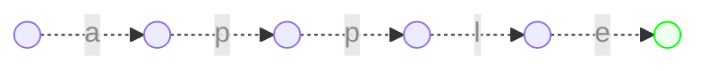
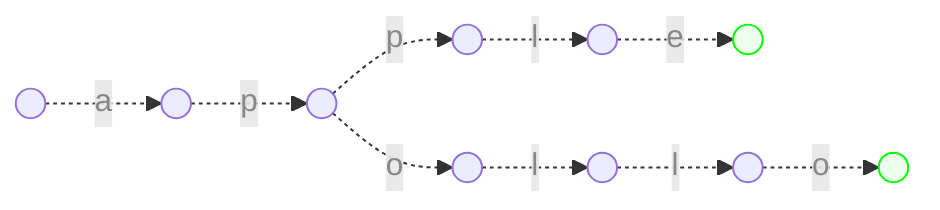
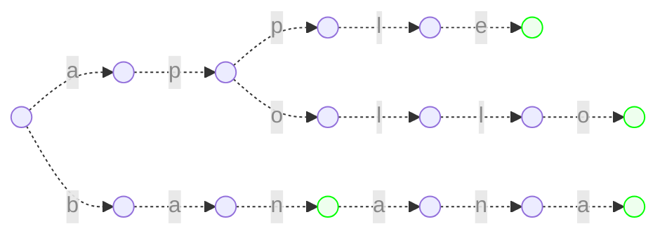
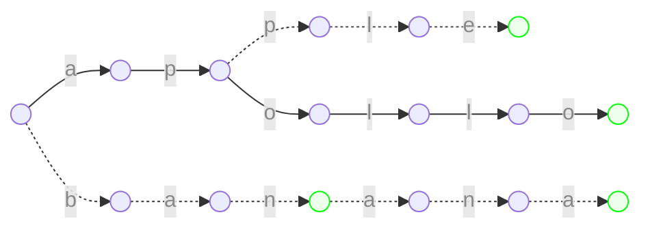
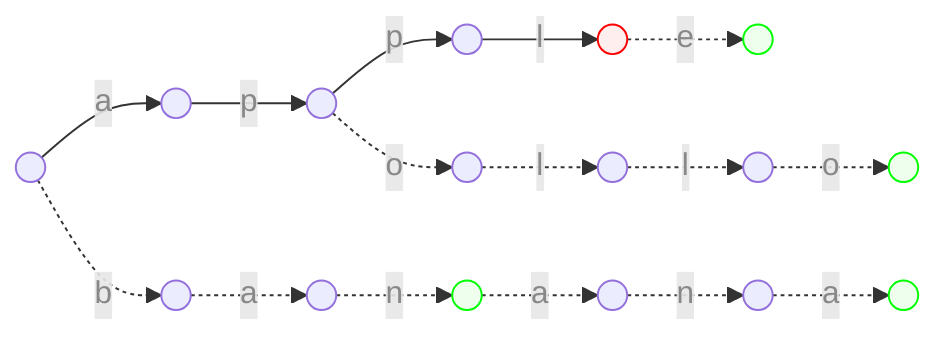
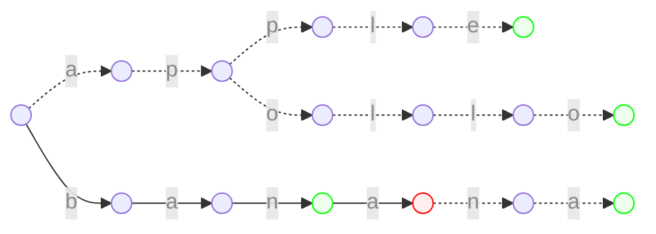

## 소개

트라이란 문자열의 집합을 트리로 관리하는 자료구조이다. 물론 문자열이 아니더라도 어떠한 수열의 정보를 저장하는 데에 쓰일 수 있다. 트라이를 사용하면 문자열 집합에 임의의 문자열이 속하는지를 빠르게 구할 수 있다.

## 원리

다음 문자열 집합을 트라이로 저장해보자.

> $\lbrace\text{apple, apollo, ban, banana}\rbrace$

문자열의 각 문자를 경로라고 생각하고 트리를 구성하면 된다. 이를테면 $\text{apple}$이라는 문자열은 트리의 루트부터 차례대로 $\text a$, $\text p$, $\text p$, $\text l$, $\text e$의 간선을 만들어주면 된다.



다음으로 문자열 $\text{apollo}$를 저장해보자. 루트에서부터 차례대로 $\text a$, $\text p$, $\text o$, $\text l$, $\text l$, $\text o$의 간선을 만들되 이미 만들어진 간선이 있을 경우 새로 만들지 않고 재활용한다.



저장을 마친 후 트라이의 모습은 다음과 같다. 초록색으로 표시된 정점는 집합 내의 어떠한 단어의 종점임을 나타낸다.



문자열 집합으로부터 트라이를 만들어낼 때의 시간복잡도는 문자열 집합의 모든 문자열의 길이의 합인 $O(\sum{\left\vert S\right\vert})$이 될 것이다. 만들어진 트라이를 바탕으로 문자열 집합에 특정 문자열이 속하는지를 판별해보자. 트리를 따라가면서 알파벳의 간선이 있는지를 확인하면서 진행하되, 초록색 정점에서 끝나는지를 보면 된다.

- 문자열이 존재하는 경우

> 주어진 문자열 = $\text{apollo}$

문자열과 매칭되는 루트가 존재하므로 이 문자열은 집합에 존재한다.


    
- 문자열이 존재하지 않는 경우

> 주어진 문자열 = $\text{application}$

문자열과 매칭되는 루트가 존재하지 않으므로 이 문자열은 집합에 존재하지 않는다.



> 주어진 문자열 = $\text{bana}$

문자열과 매칭되는 루트는 존재하지만, 초록색 정점에서 끝나지 않으므로 이 문자열은 집합에 존재하지 않는다.



트라이에 임의의 문자열이 존재하는지를 평가할 때의 시간복잡도는 그 문자열의 길이인 $O(|S|)$가 될 것이다. 이는 집합에 속한 모든 문자열에 대해서 일치 여부를 검사하는 시간보다 적다.

## 구현

```python
class Trie:
    # 트라이의 각 정점이다.
    # 알파벳 간선과 end_flag를 저장한다.
    class Node:
        def __init__(self):
            self.edge: dict[str: 'Trie.Node'] = { }
            self.end_flag = False

    def __init__(self):
        self.root = Trie.Node()
    
    # 트라이에 문자열을 추가한다.
    def add(self, string: str):
        now = self.root
        for s in string:
            if s not in now.edge:
                now.edge[s] = Trie.Node()
            now = now.edge[s]
        now.end_flag = True
    
    # 트라이에 문자열이 포함되어있는지를 검사한다.
    def contains(self, string: str) -> bool:
        now = self.root
        for s in string:
            if s not in now.edge:
                return False
            now = now.edge[s]
        return now.end_flag
```